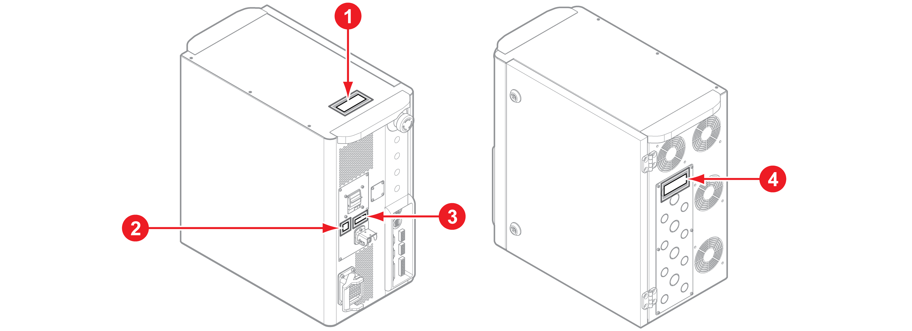
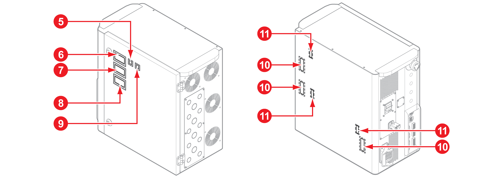
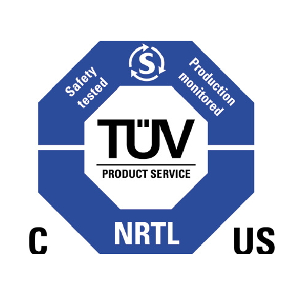
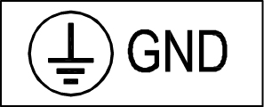

# 1.2.3 안전 레이블

제어기의 내외부에는 명판과 경고 표시, 안전 기호 등이 부착되어 있습니다. 부착된 레이블을 확인하여 안전을 확보하십시오.

####  전원 및 접지 연결 주의 사항

####  고전압 표시

####   입력 전원 표시

#### 공기 순환구 주의 사항

#### NRTL 인증 마크

#### 명판

#### 고전압 경고

#### 설치 주의 사항

#### 기능 안전 인증 마크

#### 접지선 연결 주의 사항

#### 접지 표시


**\[경고\]** : 제어기에 부착된 명판, 경고 표시, 안전 기호, 명칭 표시, 전선 마크 등의 위치를 옮기거나 페인트칠 및 커버를 씌워 가리는 행위 등 안전 레이블에 손상을 주는 일체의 행위를 금합니다.



**\[주의\]** : 로봇의 설치 영역 및 위험 지역은 형태나 색상, 스타일에서 차이를 두어 다른 시설 및 기기와 명확히 구분되도록 표시하십시오.


