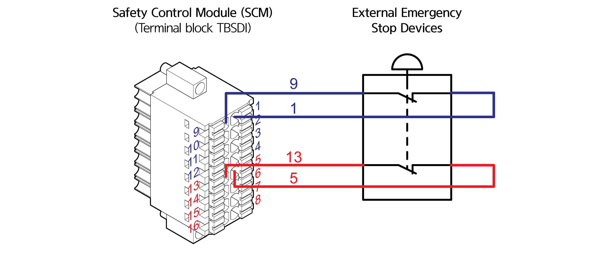

# 1.2.4.2 Connecting to emergency stop devices of external systems

In addition to the emergency stop switches installed by default, it is possible to add external emergency stop XL devices according to site conditions and applications. For more details, see “[**3.3.2.4 D-SUB 5 connector(SDIO): General purpose safety I/O signals**](../../../3-product-install/3-3-robot-interface/2-external-device-interface/4-d-sub25-connector.md)** **and** **[**4.3.2 Safety control module.**](../../../4-maintenance/4-3-controller-check-maintenance/2-safety-control-module/)”

