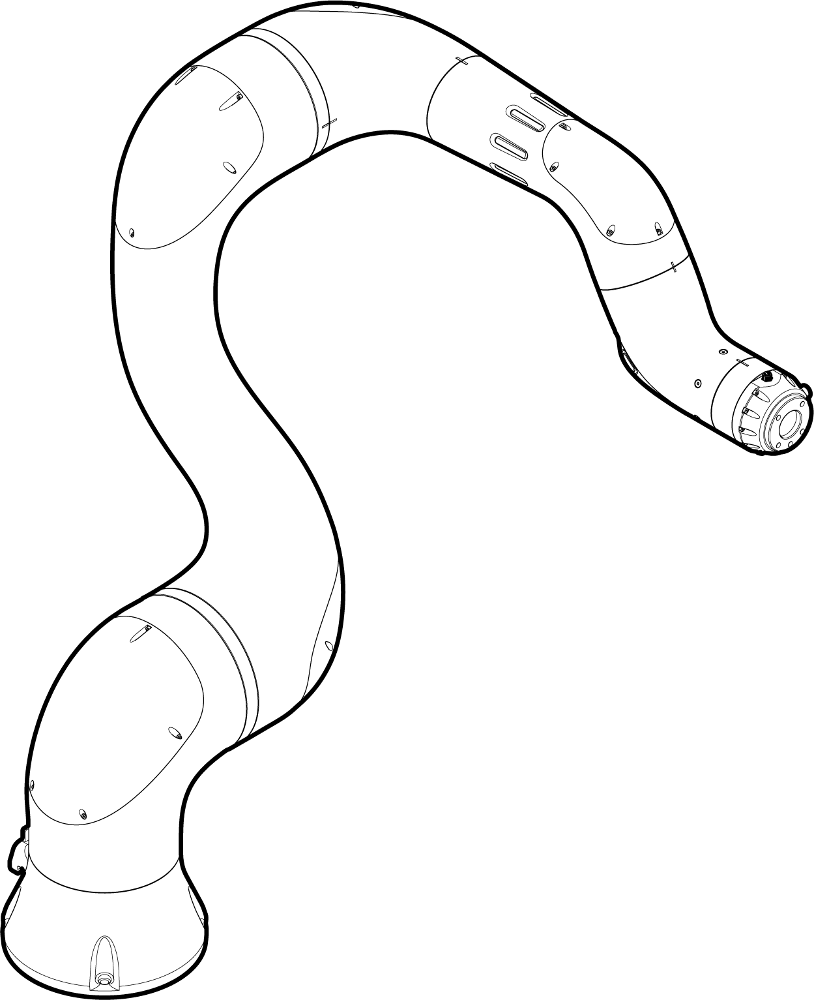
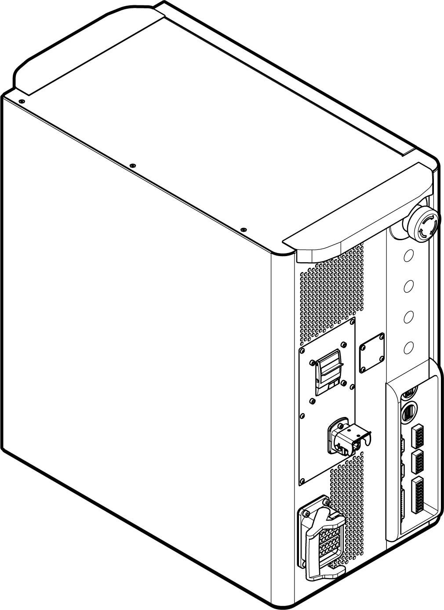
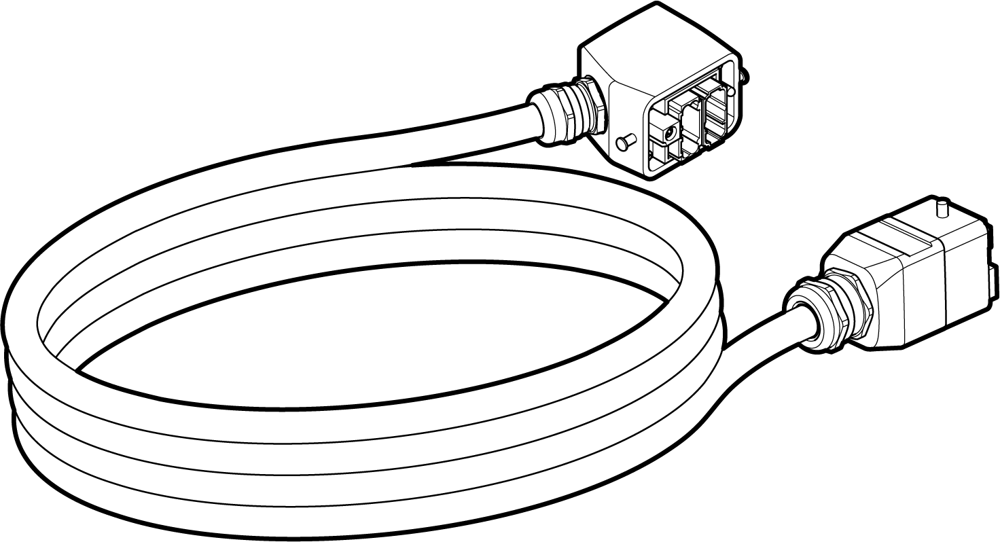
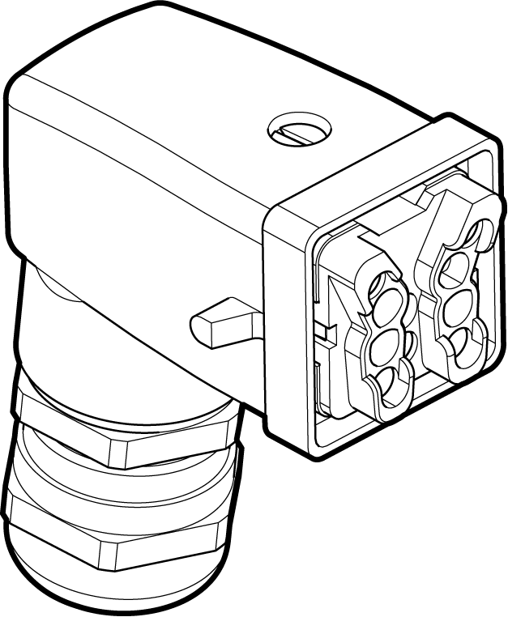
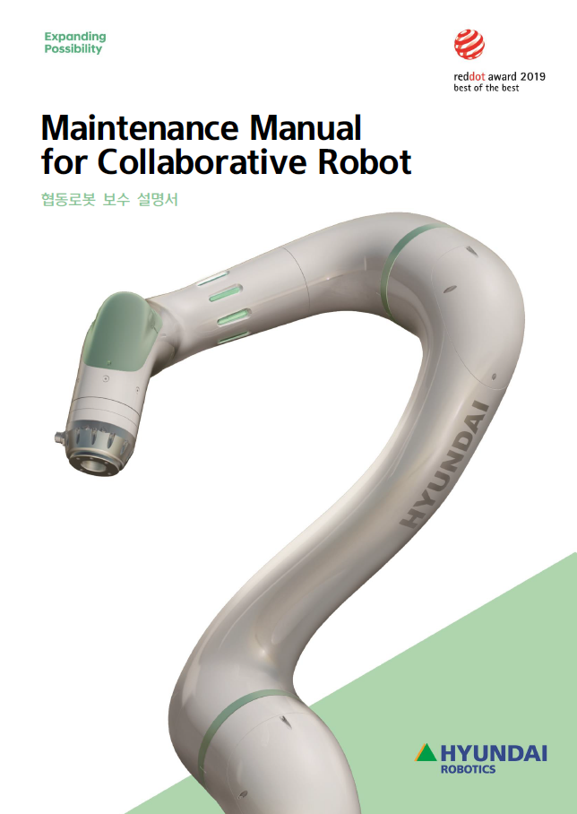

# 2.2 제품 구성


* 협동로봇 모델에는 YL005와 YL012, YL015가 있습니다. 이 보수 설명서에서는 YL012 모델을 기준으로 구성과 설치, 사용 및 보수 방법을 설명합니다.

* 협동로봇의 모델에 따라 구성품과 제품 각 부분을 비롯하여 사용 방법 등 일부 내용이 다를 수 있습니다.

* 제품의 포장재를 폐기하지 말고 보관해 두면 제품의 보관 및 운반에 이용할 수 있습니다.


