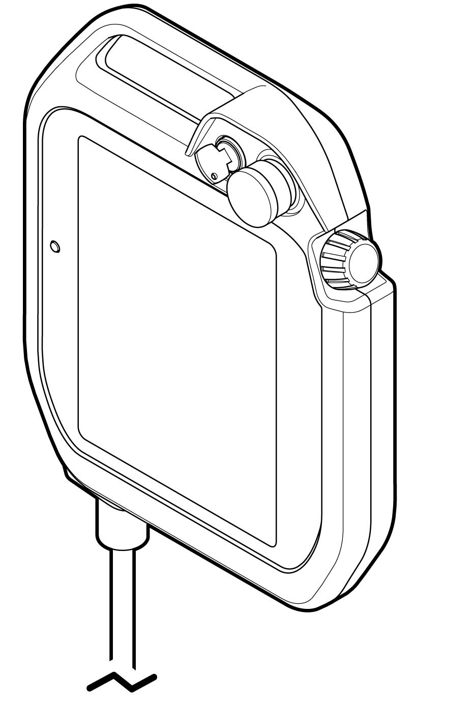

# 2.2 Product components


* The available collaborative robot models are YL005, YL012, and YL015. This maintenance manual describes the methods for assembling, installing, using, and maintaining them based on the YL012 model.

* Partial details, including components, product parts, and methods of use, may be different depending on collaborative robot models.

* If the packaging materials of the product are retained, they may later be used for transporting and storing the product.



