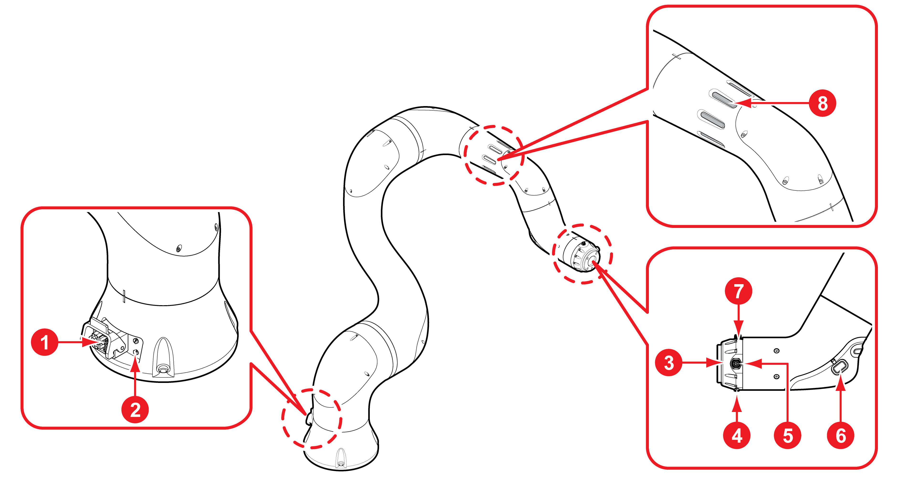
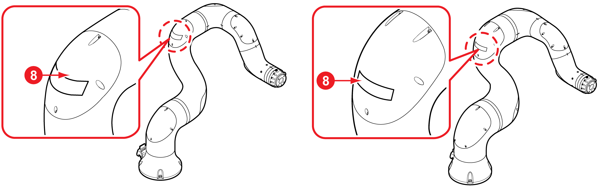

# 2.3.1 Manipulator

<table>
  <thead>
    <tr>
      <th style="text-align:center"><b>No</b>
      </th>
      <th style="text-align:center">Name</th>
      <th style="text-align:left">Description</th>
    </tr>
  </thead>
  <tbody>
    <tr>
      <td style="text-align:center">
        
      </td>
      <td style="text-align:center">
        
Power and
           
        

        
Communication
           connectors
           
        

      </td>
      <td style="text-align:left">These supply power to and communicate with the robot, respectively.</td>
    </tr>
    <tr>
      <td style="text-align:center">
        
      </td>
      <td style="text-align:center">Air inlet</td>
      <td style="text-align:left">This supplies pneumatic pressure through the pneumatic hose.</td>
    </tr>
    <tr>
      <td style="text-align:center">
        
      </td>
      <td style="text-align:center">Tool flange</td>
      <td style="text-align:left">This mounts tools to the robot.</td>
    </tr>
    <tr>
      <td style="text-align:center">
        
      </td>
      <td style="text-align:center">Air outlers</td>
      <td style="text-align:left">(YL012, YL015) These are used for moving various tools by connecting pneumatic
        hoses (&#xF8;3.2, two pieces).</td>
    </tr>
    <tr>
      <td style="text-align:center">
        
      </td>
      <td style="text-align:center">Tool I/O connectors</td>
      <td style="text-align:left">These control the motion of tools. For more details of the tool I/O, see
        &#x201C;<b>3.3.1 Tool flange connection point.</b>&#x201D;
         
         
      </td>
    </tr>
    <tr>
      <td style="text-align:center">
        
      </td>
      <td style="text-align:center">Handgrip module</td>
      <td style="text-align:left">This is used for direct teaching.</td>
    </tr>
    <tr>
      <td style="text-align:center">
        
      </td>
      <td style="text-align:center">EtherCAT connector</td>
      <td style="text-align:left">This establishes communication with tools through EtherCAT-based terminals.
        For more details of EtherCAT, see &#x201C;<b>3.3.1 Tool flange connection point</b>.&#x201D;
         
         
      </td>
    </tr>
    <tr>
      <td style="text-align:center">
        
      </td>
      <td style="text-align:center">LED lamp</td>
      <td style="text-align:left">
        
This indicates the operating states of the robot.
           
        

        <ul>
          <li>
            
OFF: The power of the robot system is off.
               
            

            

          </li>
          <li>ON: The power of the robot system is on. Different colors of the LED lamp
            indicate the following states of the robot:
             
            <ul>
              <li>
                
White: The servo motor is waiting for actuation (the power is on or the
                  brake is on) or is in the normal stop state.
                   
                

                

              </li>
              <li>
                
Green: The servo motor is actuated (the power is on or the brake is off).
                  At this state, jog operation, step forward/backward motion, and playback
                  are possible.
                   
                

                

              </li>
              <li>
                
Blue: The servo motor is actuated in the direct teaching mode. In this
                  state, only direct teaching is possible.
                   
                

                

              </li>
              <li>Red: The robot stopped operating because of an error. Resolve the error
                and try to actuate the servo motor.
                 
              </li>
            </ul>
          </li>
        </ul>
      </td>
    </tr>
  </tbody>
</table>


* Air outlets are available only for the YL012 and the YL015 models.

* The LED lamp position varies depending on the models. In the cases of the YL005 and the YL015 models, the LED lamp is on the upper frame cover.

* For Ethernet options, and Ethernet connector is installed instead of Air



