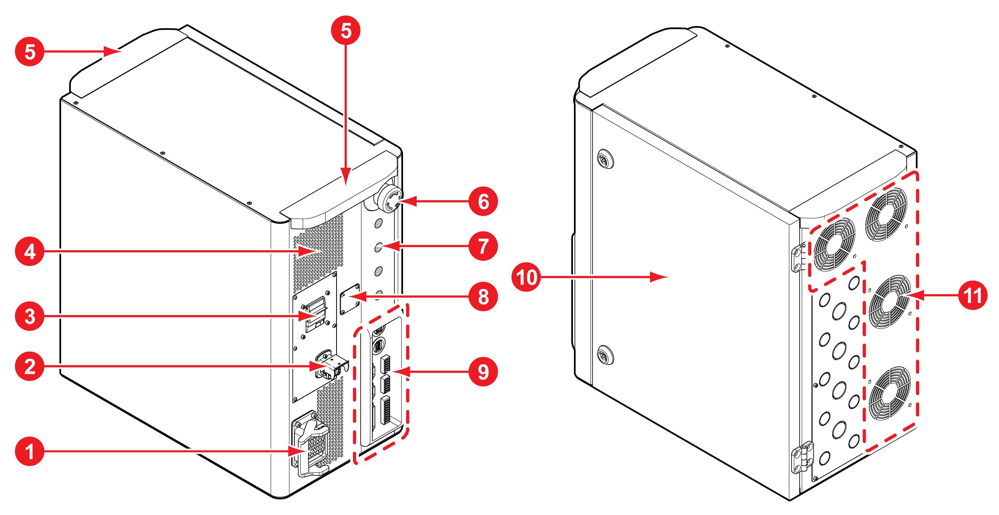

# 2.3.2 제어기

|                **번호**               |   **이름**   | 　　　　　**설명 **                             |
| :---------------------------------: | :--------: | ---------------------------------------- |
|     | 로봇 케이블 커넥터 | 통신선과 전원선이 내장되어 제어기를 기구와 연결하는 커넥터입니다.     |
|     |   전원 커넥터   | 제어기에 전원을 공급하는 커넥터입니다.                    |
|     |   전원 차단기   | 전원 스위치를 이용해 제어기의 주전원을 켜거나 끕니다.           |
|     |     환풍구    | 제어기의 냉각을 위한 공기 유입 통로입니다.                 |
|     |     손잡이    | 제어기의 전면과 후면에 장착되어 운반에 사용합니다.             |
|     |  비상 정지 스위치 | 긴급 상황 발생 시 비상 정지 스위치를 눌러 로봇의 동작을 정지시킵니다. |
|     |  응용 장치 연결구 | 응용 장치를 내부의 모듈과 케이블로 연결할 경우 사용하는 통로입니다.   |
|     | 티치 펜던트 연결구 | 직결형의 티치 펜던트를 연결하는 통로입니다.                 |
|     |  I/O 연결 블록 | 주변 기기를 제어기에 연결합니다.                       |
|    |     도어     | 도어를 열어 제어기의 측면을 개방합니다.                   |
|    |     냉각     | 제어기 내부의 가열된 공기를 외부로 강제 유출시키는 장치입니다.      |
