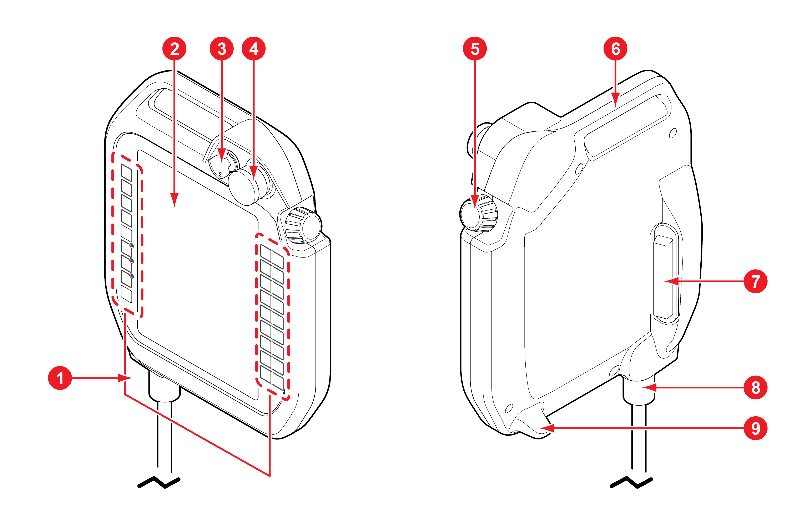

# 2.3.3 Teach pendant

|    |     Operating keys    | These are used for controlling the robot motion, entering commands, and selecting and setting menus.                                                                                                                                                                                                                                                                                       |
| :--------------------------------: | :-------------------: | ------------------------------------------------------------------------------------------------------------------------------------------------------------------------------------------------------------------------------------------------------------------------------------------------------------------------------------------------------------------------------------------ |
|    |        Display        | This displays and allows modification of the robot’s motion states and setting information.                                                                                                                                                                                                                                                                                                |
|    |      Mode switch      | This can be rotated for selecting operating modes (automatic, manual, and remote).                                                                                                                                                                                                                                                                                                         |
|    | Emergency stop switch | This button is pressed to stop the motion of the robot in case of an emergency.                                                                                                                                                                                                                                                                                                            |
|    |        Jog dial       | This can be rotated for selecting menus.                                                                                                                                                                                                                                                                                                                                                   |
|    |    Mounting bracket   | This is used for keeping the teach pendant suspended or hung.                                                                                                                                                                                                                                                                                                                              |
|    |   Enabling switch     | 
This is used as a safety switch when the robot is operated by the teach pendant in manual mode.


<ul><li><strong>Position 1, Position 3</strong>: At these positions, the robot operation is stopped. At position 3, it returns to position 1 without going through position 2.
</li><li><strong>Position 2</strong>: At this position, the robot can be operated.</li></ul> |
|    |    Cable connector    | This connects cables with the controller.                                                                                                                                                                                                                                                                                                                                                  |
|    |        USB port       | This is for connecting USB devices such as portable storage media.                                                                                                                                                                                                                                                                                                                         |
