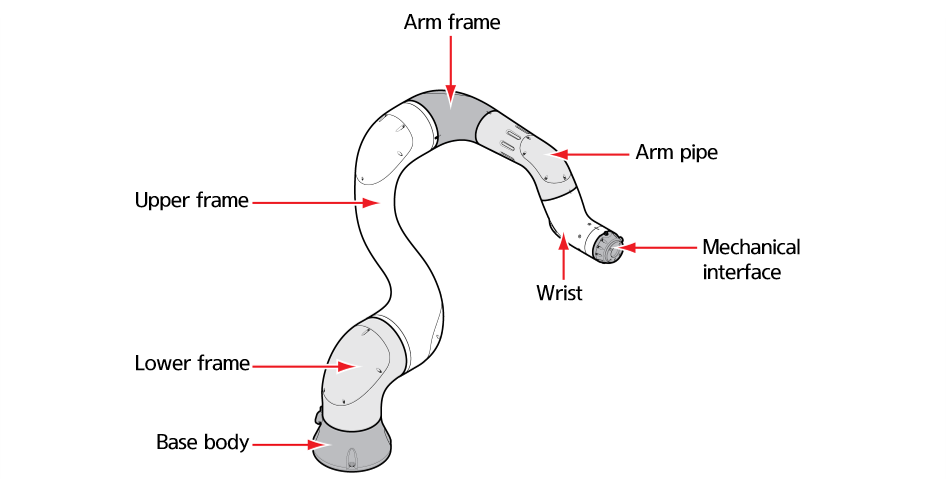
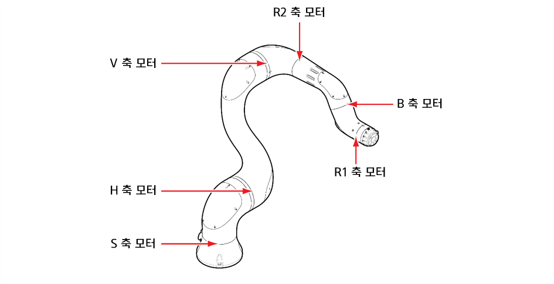
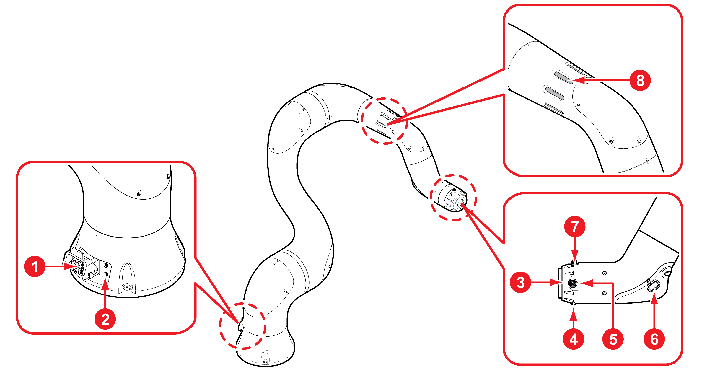
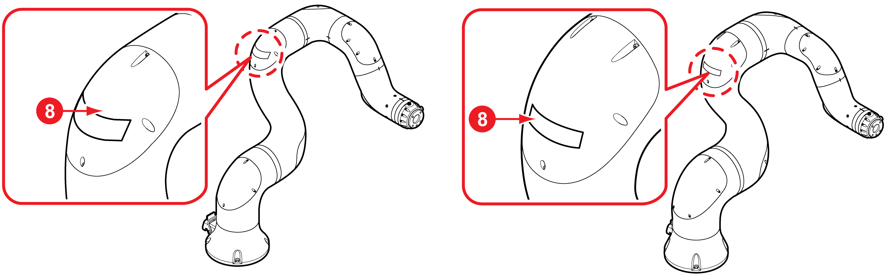

# 2.3.1 로봇 기구

<table>
  <thead>
    <tr>
      <th style="text-align:center"><b>&#xBC88;&#xD638;</b>
      </th>
      <th style="text-align:center"><b>&#xC774;&#xB984;</b>
      </th>
      <th style="text-align:left"> <b>&#xC124;&#xBA85;</b>
      </th>
    </tr>
  </thead>
  <tbody>
    <tr>
      <td style="text-align:center">
        
      </td>
      <td style="text-align:center">&#xC804;&#xC6D0; &#xBC0F; &#xD1B5;&#xC2E0; &#xCEE4;&#xB125;&#xD130;</td>
      <td
      style="text-align:left">&#xB85C;&#xBD07;&#xC5D0; &#xC804;&#xC6D0;&#xC744; &#xACF5;&#xAE09;&#xD558;&#xACE0;
        &#xB85C;&#xBD07;&#xACFC; &#xD1B5;&#xC2E0;&#xD569;&#xB2C8;&#xB2E4;.</td>
    </tr>
    <tr>
      <td style="text-align:center">
        
      </td>
      <td style="text-align:center">&#xC5D0;&#xC5B4; &#xC778;&#xB81B;</td>
      <td style="text-align:left">&#xACF5;&#xC555; &#xD638;&#xC2A4;&#xB97C; &#xC5F0;&#xACB0;&#xD558;&#xC5EC;
        &#xACF5;&#xC555;&#xC744; &#xACF5;&#xAE09;&#xD569;&#xB2C8;&#xB2E4;.</td>
    </tr>
    <tr>
      <td style="text-align:center">
        
      </td>
      <td style="text-align:center">&#xD234; &#xD50C;&#xB79C;&#xC9C0;</td>
      <td style="text-align:left">&#xB85C;&#xBD07;&#xC5D0; &#xD234;&#xC744; &#xC7A5;&#xCC29;&#xD569;&#xB2C8;&#xB2E4;.</td>
    </tr>
    <tr>
      <td style="text-align:center">
        
      </td>
      <td style="text-align:center">&#xC5D0;&#xC5B4; &#xC544;&#xC6C3;&#xB81B;</td>
      <td style="text-align:left">(YL012, YL015) &#xACF5;&#xC555; &#xD638;&#xC2A4;(&#xF8;3.2, 2&#xAC1C;)&#xB97C;
        &#xC5F0;&#xACB0;&#xD558;&#xC5EC; &#xB2E4;&#xC591;&#xD55C; &#xD234;&#xC758;
        &#xC6C0;&#xC9C1;&#xC784;&#xC5D0; &#xC0AC;&#xC6A9;&#xD569;&#xB2C8;&#xB2E4;.</td>
    </tr>
    <tr>
      <td style="text-align:center">
        
      </td>
      <td style="text-align:center">&#xD234; I/O &#xCEE4;&#xB125;&#xD130;</td>
      <td style="text-align:left">&#xD234;&#xC758; &#xB3D9;&#xC791;&#xC744; &#xC81C;&#xC5B4;&#xD569;&#xB2C8;&#xB2E4;.
        &#xD234; I/O&#xC5D0; &#xB300;&#xD55C; &#xC790;&#xC138;&#xD55C; &#xC815;&#xBCF4;&#xB294;
        &#x201C;<b>3.3.1 &#xD234; &#xD50C;&#xB79C;&#xC9C0; &#xC5F0;&#xACB0;&#xBD80;</b>&#x201D;&#xB97C;
        &#xCC38;&#xC870;&#xD558;&#xC2ED;&#xC2DC;&#xC624;.</td>
    </tr>
    <tr>
      <td style="text-align:center">
        
      </td>
      <td style="text-align:center">&#xD578;&#xB4DC;&#xADF8;&#xB9BD; &#xBAA8;&#xB4C8;</td>
      <td style="text-align:left">&#xC9C1;&#xC811; &#xAD50;&#xC2DC;&#xC5D0; &#xC0AC;&#xC6A9;&#xD569;&#xB2C8;&#xB2E4;.</td>
    </tr>
    <tr>
      <td style="text-align:center">
        
      </td>
      <td style="text-align:center">&#xC774;&#xB354;&#xCEA3; &#xCEE4;&#xB125;&#xD130;</td>
      <td style="text-align:left">&#xC774;&#xB354;&#xCEA3;(EtherCAT) &#xAE30;&#xBC18;&#xC758; &#xB2E8;&#xC790;&#xB85C;
        &#xD234;&#xACFC; &#xD1B5;&#xC2E0;&#xD569;&#xB2C8;&#xB2E4;. &#xC774;&#xB354;&#xCEA3;&#xC5D0;
        &#xB300;&#xD55C; &#xC790;&#xC138;&#xD55C; &#xC815;&#xBCF4;&#xB294; &#x201C;<b>3.3.1 &#xD234; &#xD50C;&#xB79C;&#xC9C0; &#xC5F0;&#xACB0;&#xBD80;</b>&#x201D;&#xB97C;
        &#xCC38;&#xC870;&#xD558;&#xC2ED;&#xC2DC;&#xC624;.</td>
    </tr>
    <tr>
      <td style="text-align:center">
        
      </td>
      <td style="text-align:center">LED &#xB7A8;&#xD504;</td>
      <td style="text-align:left">
        
&#xB85C;&#xBD07;&#xC758; &#xB3D9;&#xC791; &#xC0C1;&#xD0DC;&#xB97C; &#xD45C;&#xC2DC;&#xD569;&#xB2C8;&#xB2E4;.
           
        

        

          OFF: &#xB85C;&#xBD07; &#xC2DC;&#xC2A4;&#xD15C;&#xC758; &#xC804;&#xC6D0;&#xC774;
          &#xAEBC;&#xC838; &#xC788;&#xC2B5;&#xB2C8;&#xB2E4;.

        

          ON: &#xB85C;&#xBD07; &#xC2DC;&#xC2A4;&#xD15C;&#xC758; &#xC804;&#xC6D0;&#xC774;
          &#xCF1C;&#xC838; &#xC788;&#xC2B5;&#xB2C8;&#xB2E4;. LED &#xB7A8;&#xD504;&#xC758;
          &#xC0C9;&#xC5D0; &#xB530;&#xB978;

        
&#xB85C;&#xBD07;&#xC758; &#xC0C1;&#xD0DC;&#xB294; &#xB2E4;&#xC74C;&#xACFC;
          &#xAC19;&#xC2B5;&#xB2C8;&#xB2E4;.
           
        

        

          &#xD770;&#xC0C9;: &#xC11C;&#xBCF4; &#xD65C;&#xC131;&#xD654; &#xB300;&#xAE30;(&#xC804;&#xC6D0;&#xC774;
          &#xCF1C;&#xC838; &#xC788;&#xAC70;&#xB098; &#xBE0C;&#xB808;&#xC774;&#xD06C;
          &#xC801;&#xC6A9;)

        
&#xB610;&#xB294; &#xC77C;&#xBC18;&#xC815;&#xC9C0; &#xC0C1;&#xD0DC;&#xC785;&#xB2C8;&#xB2E4;.
           
        

        

          &#xCD08;&#xB85D;&#xC0C9;: &#xC11C;&#xBCF4; &#xD65C;&#xC131;&#xD654;(&#xC804;&#xC6D0;&#xC774;
          &#xCF1C;&#xC838; &#xC788;&#xAC70;&#xB098; &#xBE0C;&#xB808;&#xC774;&#xD06C;
          &#xD480;&#xB9BC;) &#xC0C1;&#xD0DC;

        
&#xC785;&#xB2C8;&#xB2E4;. &#xC870;&#xADF8;, &#xC2A4;&#xD15D; &#xC804;&#xD6C4;&#xC9C4;
          &#xBC0F; &#xC7AC;&#xC0DD;&#xD560; &#xC218; &#xC788;&#xC2B5;&#xB2C8;&#xB2E4;.
           
        

        

          &#xD30C;&#xB780;&#xC0C9;: &#xC9C1;&#xC811; &#xAD50;&#xC2DC; &#xBAA8;&#xB4DC;&#xC5D0;&#xC11C;
          &#xC11C;&#xBCF4; &#xD65C;&#xC131;&#xD654; &#xC0C1;&#xD0DC;&#xC785;&#xB2C8;&#xB2E4;.
          &#xC9C1;&#xC811; &#xAD50;&#xC2DC;

        
&#xB9CC; &#xAC00;&#xB2A5;&#xD569;&#xB2C8;&#xB2E4;.
           
        

        

          &#xBE68;&#xAC04;&#xC0C9;: &#xC5D0;&#xB7EC;&#xAC00; &#xBC1C;&#xC0DD;&#xD558;&#xC5EC;
          &#xB85C;&#xBD07;&#xC774; &#xC815;&#xC9C0;&#xB41C; &#xC0C1;&#xD0DC;&#xC785;&#xB2C8;&#xB2E4;.
          &#xBB38;&#xC81C;&#xB97C;

        
&#xD574;&#xACB0;&#xD558;&#xACE0; &#xC11C;&#xBCF4; &#xD65C;&#xC131;&#xD654;&#xB97C;
          &#xC2DC;&#xB3C4;&#xD558;&#xC2ED;&#xC2DC;&#xC624;.
           
        

        

      </td>
    </tr>
  </tbody>
</table>


* 에어 아웃렛은 YL012와 YL015 모델에만 지원됩니다.

* LED 램프는 모델에 따라 장착된 위치가 다릅니다. YL005와 YL015 모델의 경우 Upper frame cover에 LED 램프가 있습니다.

* 이더넷 옵션일 경우, 에어 대신 이더넷 커넥터가 설치됩니다.


