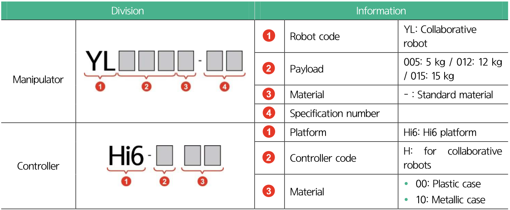

# 2.4 Nameplate

The nameplate attached to the product contains information, such as robot type, manufacture number, and manufacture date. Compare this with the specifications of the purchased product to ensure they are consistent with each other.

The model names of Hyundai Robotics collaborative robots and controllers are denoted as follows:

