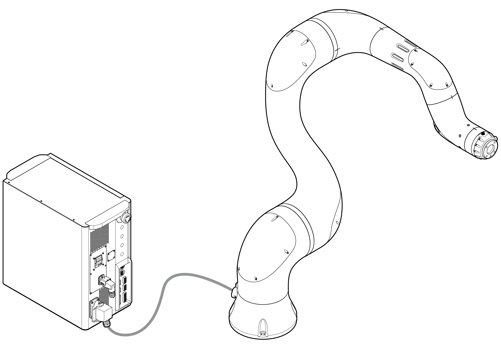

# 2. 제품 소개

이 제품은 다양한 툴을 이용하여 물체를 운반하거나 부품을 조립하는데 사용할 수 있는 산업용 협동로봇으로 설명서에 명시된 조건을 만족하는 환경에서만 사용할 수 있습니다. 이 제품에는 사람과의 협업을 목적으로 제작되어 물리적인 보호 기구 없이도 사람과의 협동을 가능하게 하는 안전 기능이 탑재되어 있습니다.


**\[주의\]**: 툴, 작업 대상물, 기타 추가 장비 등과 연동된 시스템을 구성할 경우에는 반드시 최종 위험성 평가를 수행하여 안정성이 입증된 후 사용하십시오.


