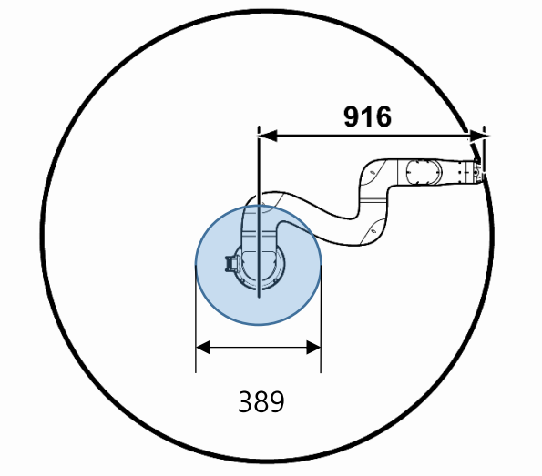

# 3.1.2 로봇 시스템 영역

로봇 시스템의 영역은 여러 단계가 있으며 협동로봇이 움직일 수 있는 최대 작업 영역은 모델별로 다릅니다. 다음 정보를 확인하고 운전 목적과 모델별 최대 작업 영역에 따라 알맞게 영역을 구성하십시오.

로봇 시스템과 작업자가 접촉하여 수행하는 협동운전에서 작업자는 안전 영역 내에서 작업합니다. 반면 로봇과 작업자의 접촉이 허가되지 않는 협동운전의 경우, 작업자는 보호 영역 내에서만 작업할 수 있습니다. 일반적인 산업용 로봇을 운전하는 경우에는 작업자는 보호 영역 밖에서 작업해야 합니다.

* 운전 영역\(Operating space\): 작업 프로그램에 따라 로봇이 움직이는 동안 사용되는 제한 영역의 한 영역

* 제한 영역\(Restricted space\): 제한 장치에 의해 제한되는 최대 영역의 한 영역

* 보호 영역\(Safeguarded space\): 보호 장치가 작동되는 영역

* 최대 영역\(Maximum space\): 로봇이 움직이는 영역으로 다다를 수 있는 영역

협동로봇이 움직일 수 있는 최대 작업 영역은 모델별로 다릅니다. 모델별 최대 작업 영역은 다음과 같습니다.

* YL005: 916 mm

* YL012: 1,305 mm

* YL015: 963 mm

