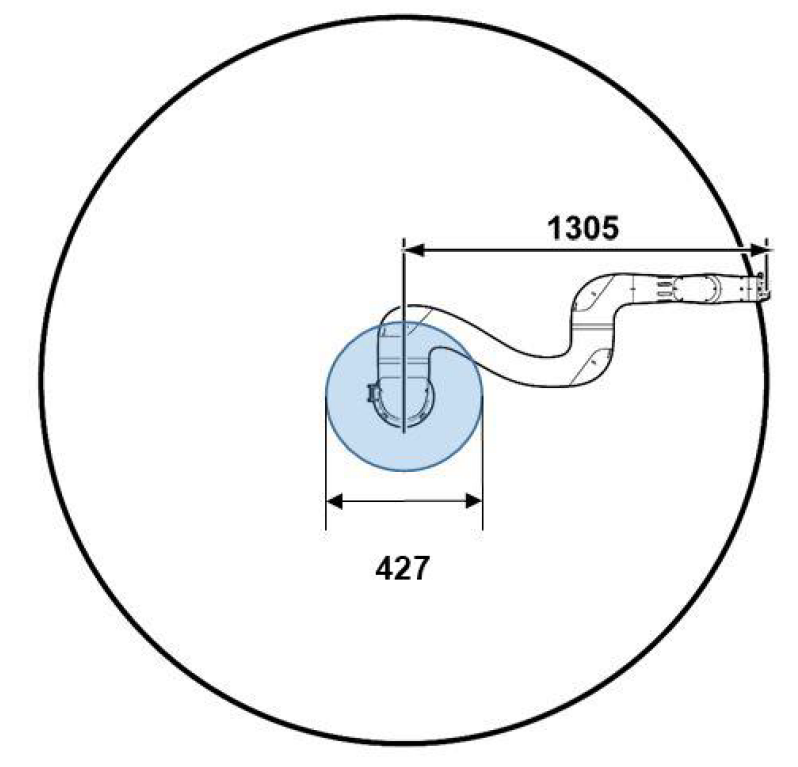
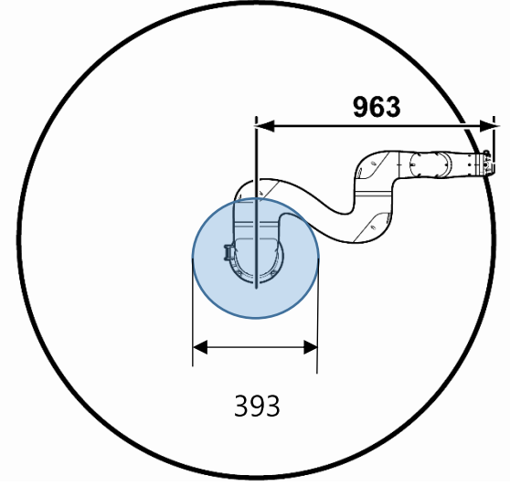

# 3.1.2 Spaces of the robot system

Check the following information, and arrange the space adequately to meet the operating purpose and the maximum operating space of the model.

In collaborative operation in which the operator is allowed to contact the robot system, the operator should work within the operating space. On the contrary, in collaborative operation in which the operator is not allowed to contact the robot system, the operator should work only in the safeguarded space. In the general operation of industrial robots, the operator should work outside of the safeguarded space.

* Operating space: A part of the restricted space that is used while the robot moves according to the operating program

* Restricted space: A part of the maximum space that is restricted by restricting devices

* Safeguarded space: A space for which safeguarding devices run

* Maximum space: A space in which the robot can move to the maximum extent

The maximum working spaces of collaborative robots vary depending on models. The maximum working spaces of models are as follows:


Not all postures are possible even within the working area, so it is recommended to check through HRSpace.


* YL005: 916 mm

* YL012: 1,305 mm

* YL015: 963 mm


In the above cylindrical space passing through the S-axis, even if the tool flange moves slowly, other joints move quickly, possibly causing inefficient operation and damage to the robot. Therefore, it is not recommended to perform any operation in this space.


