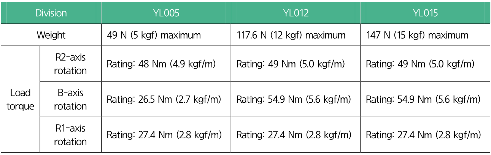

# 3.1.3 Allowable limit of wrist axis load

The load to be applied to the tip of the wrist axis of a collaborative robot is regulated by the allowable weight, load torque, and moment of inertia. The allowable limits of wrist axis load of the models are as follows:

