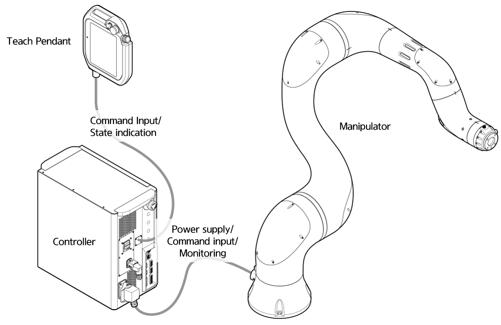

# 3.2.1 Composition of robot systems

A collaborative robot system, as an integrated system interfaced with peripheral devices, should be composed and connected with a selection of adequate peripheral devices.

* **Teach pendant**: This is the I/O device that enables command input and state view for controlling the entire robot system. It can teach specific postures to the robot or set/control the program.

* **Controller**: This controls the motion of the robot according to the setting values of the program configured by the teach pendant. Using the I/O ports of the controller, you can compose a system interfaced with various external equipment or devices. 

* **Manipulator**: This is a robot intended for attaching various tools and making collaborative operation for moving objects or assembling parts. 

