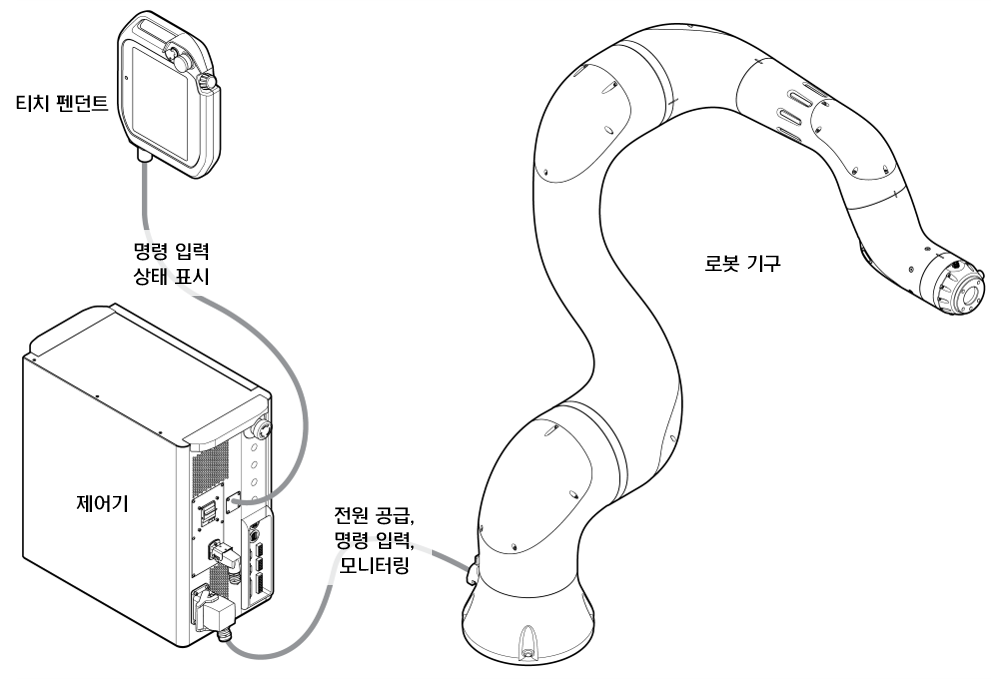

# 3.2.1 로봇 시스템 구성

협동로봇은 주변 장비와 연동된 통합 시스템으로 알맞은 주변 장치를 선택하여 시스템을 구성하고 연결합니다.

* **티치 펜던트**: 로봇 시스템 전체를 관리하기 위하여 명령을 입력하거나 상태를 확인할 수 있는 입출력 장치입니다. 로봇에게 특정 자세를 학습시키거나 프로그램을 설정 및 제어할 수 있습니다.

* **제어기**: 티치 펜던트로 설정한 프로그램의 설정값에 따라 로봇의 동작을 조정합니다. 제어기의 입출력 포트를 이용해 다양한 외부 장비 또는 장치와 연동하여 시스템을 구성할 수 있습니다.

* **로봇 기구**: 다양한 툴을 부착하여 물체를 운반하거나 부품을 조립하는데 사용하는 협동 운전 전용 머니퓰레이터입니다.

