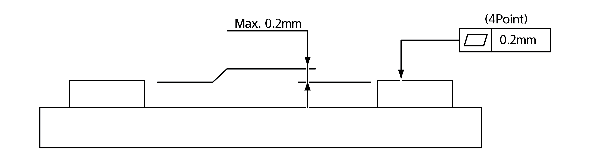

# 3.2.2.1 Mounting plate installation

The firmness of the floor on which the manipulator will be installed should be designed to minimize the dynamic impact of the robot. If the firmness of the installation surface is not sufficient for supporting the robot arm, a mounting plate for the product installation may be used.


**\[Warning\]**: The robot installation surface should be firm enough to bear both the weight of the robot and the load that occurs during robot operation.


1. Check the installation surface of the collaborative robot, and remove any uneven points, cracks, and others.

2. Place the mounting plate on the surface on which the manipulator will be installed.

3. Pass the anchor bolts \(M20\) through the bolt holes of the top contacting surface of the mounting plate, and fixate them by fastening to an adequate torque or by hammering them. The anchor bolts should not protrude from the contacting surface of the mounting plate by no more than 0.2 mm \(±0.1 mm\).

* The flatness of the other areas should be no more than ±0.2 mm.

* The flatness of the four sheets of the mounting plates should be no more than 0.2 mm.

* The flatness of the four contacting surfaces of the mounting plates should be no more than 0.2 mm \(±0.1 mm\).

* Fill any gaps with shims when necessary.

