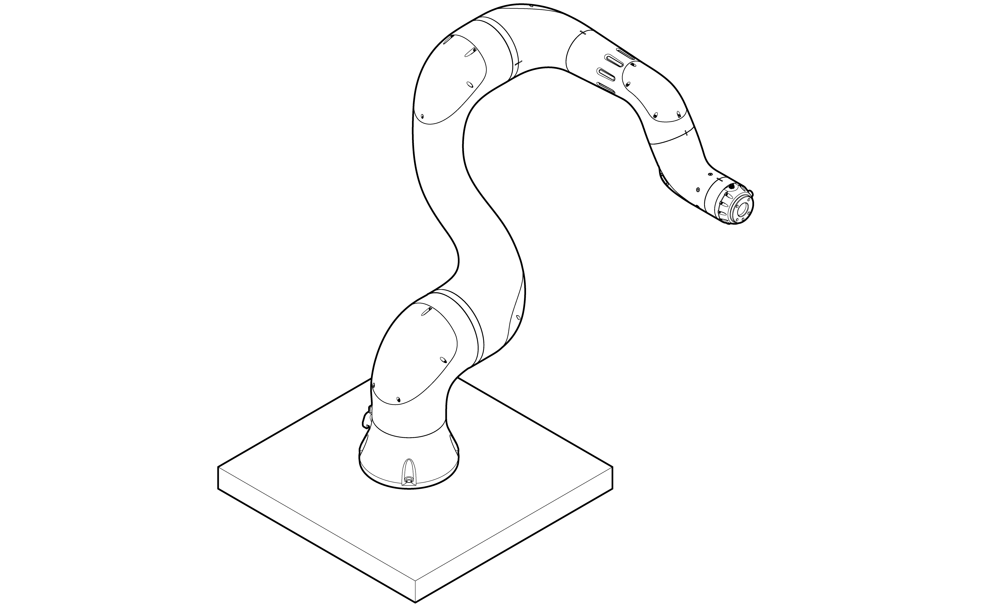
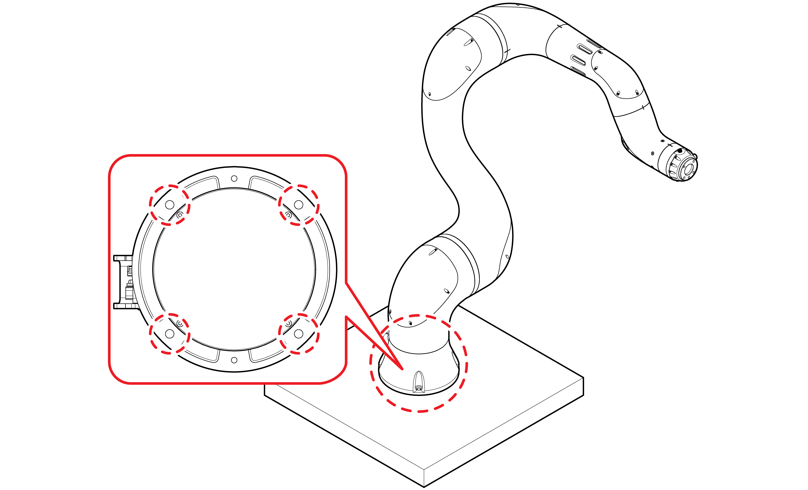

# 3.2.2 Robot and controller installation

1. Check the concrete thickness of the surface on which the collaborative robot will be installed. Follow the procedure below according to the concrete thickness.

* If it is ≥200 mm, fixate the mounting plate at the robot installation point, referring to “**3.2.2.1 Mounting plate installation**.”

* If it is ≤200 mm, consult with our Customer Support Team and carry out additional foundation work.

2. Put the Manipulator on the installation point.


**\[Warning\]**: Because the manipulator cannot stand by itself, the installation requires two or more workers. While one worker holds the robot, the other worker\(s\) should fixate it.


3. Using hex wrench bolts \(M8 \(12.9\), four pieces\), fixate the manipulator.

* The proper tightening torque of the bolts is 340 kgf/cm.

* If positioning pins are used \(Ф6, two pieces\), installing the manipulator will be accurate at a desired specific point.

* Connecting an earth cable will prevent electrostatic discharge.

* The information on the installation positions of YL005 and YL015 is the same as that of YL012.


**\[Warning\]**: Tighten the bolts firmly so that do not become loose during robot operation.


4. Ensure that the robot base is in full contact with the installation surface.

5. Check the installation space of the manipulator, and place the robot controller at a proper point.


**\[Caution\]**

* Place the controller at a cool and dry place, and keep it away from moisture or water.

* Allow sufficient buffer space around the controller for air circulation. Ensure that no obstacles block the vent hole and the cooling fan on the front and the rear of the controller.


