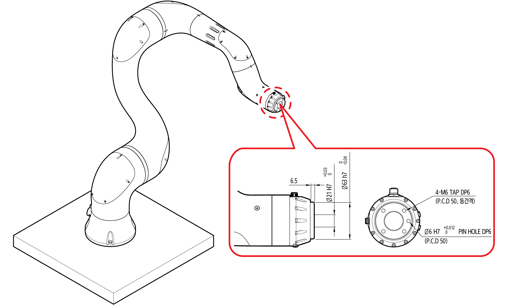
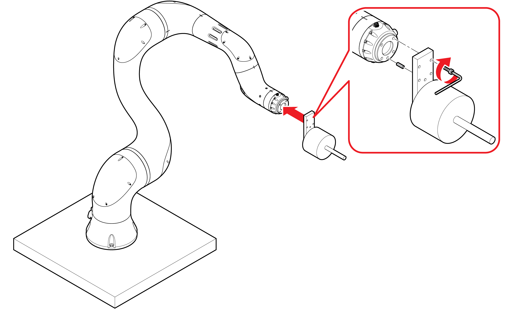
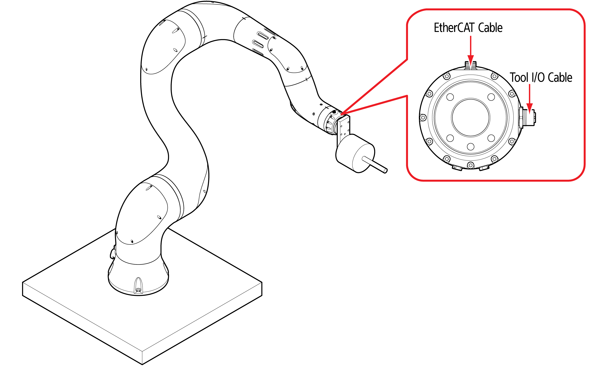

# 3.2.3 Tool connection

Connect a necessary tool to the manipulator.

1. Check the connection port of the tool flange of manipulator.

2.  Insert the tool into the tool flange, and fixate the tool to the flange by using hex wrench bolts \(M6 \(12.9\), four pieces\) and pins \(ø6\).

* The proper tightening torque of the bolts is 127 kgf/cm.

3. To the connectors of the tool flange, connect the tool I/O cable and the EtherCAT cable.

* If a pneumatic line needs to be used, assemble the one-touch fittings \(M5\), and connect the hoses \(Ф3.2, two pieces\) to the air outlets.


* The connection methods may vary depending on the tools to be used. For more details of the tool connection method, see the manual of the tool.

* For more details of the tool I/O and the pin map of EtherCAT, see “**3.3.1 Tool flange connection point**.”



