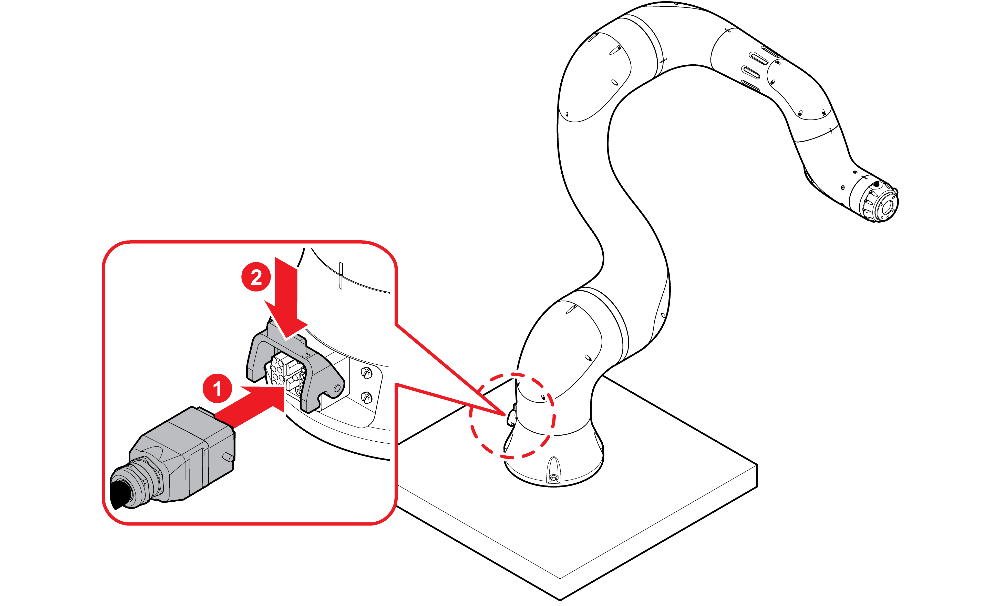
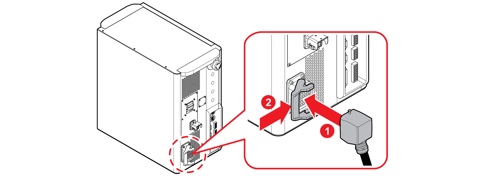
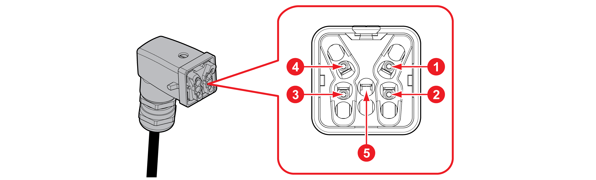
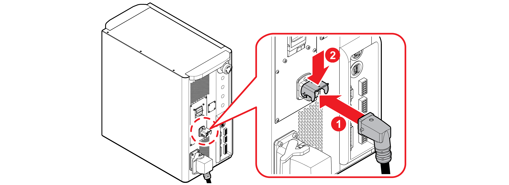

# 3.2.4 배선

협동로봇과 제어기의 연결부를 확인하고 알맞은 케이블을 연결합니다.

1. 로봇 연결 케이블을 협동로봇 베이스의 연결 단자에 끼운 후 케이블이 빠지지 않도록 고정용 고리로 고정하십시오.

2. 로봇 연결 케이블의 반대쪽 끝을 제어기 정면의 연결 단자에 끼운 후 케이블이 빠지지 않도록 고정용 고리로 고정하십시오.

3. 전원 연결용 커넥터 핀 맵을 확인하고 전원 연결용 커넥터를 전원 케이블의 한쪽 끝에 연결하십시오.

| **번호** | **이름** | **설명** | **사양** |
| :---: | :---: | :---: | :---: |
|    | R | AC220V L상 | 16 AWG |
|    | \(R\) | AC220V L상 부가\(전원 증설 시 연결\) | 16 AWG |
|    | \(T\) | AC220V T상 부가\(전원 증설 시 연결\) | 16 AWG |
|    | T | AC220V T상 | 16 AWG |
|    | FG | 접지\(Frame ground\) | 16 AWG |

4. 전원 연결용 커넥터를 제어기 정면의 전원 커넥터에 끼운 후 케이블이 빠지지 않도록 고정용 고리로 고정하십시오.

5. 전원 케이블 반대쪽 끝을 전원에 연결하십시오.


**\[주의\]**

* 모든 유형의 배선, 단자 및 전기 관련 작업을 수행하기 전에는 반드시 제품의 전원을 차단하십시오.

* 케이블 커넥터의 모양을 확인하여 알맞은 단자에 연결하고 무리한 힘을 가하지 마십시오. 핀이 휘거나 손상될 수 있습니다.

* 케이블을 임의로 개조하거나 연장하지 마십시오.

* 당사에서는 고객 부주의, 조작 미숙 및 과실로 인한 제품의 손상 및 파손에 대해 책임지지 않습니다. 절대 무단으로 제품을 개조, 분해 및 수리하지 마십시오.


