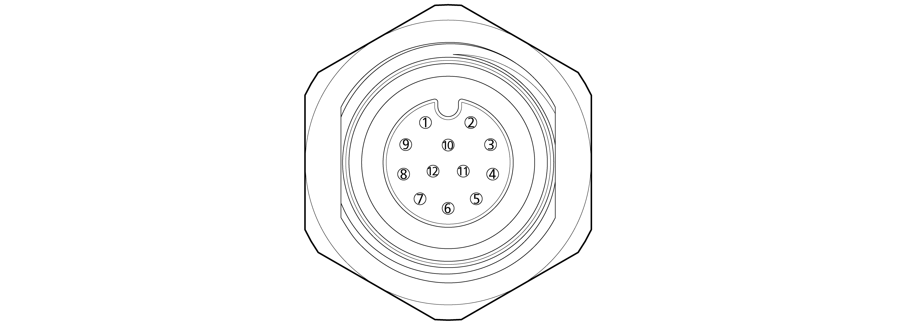

# 3.3.1.2 T41171130012-001 \(TE\) 핀 맵

<table>
  <thead>
    <tr>
      <th style="text-align:left">&#xBC88;&#xD638;</th>
      <th style="text-align:left">&#xC124;</th>
      <th style="text-align:left">&#xBC88;&#xD638;</th>
      <th style="text-align:left">&#xC124;&#xBA85;</th>
    </tr>
  </thead>
  <tbody>
    <tr>
      <td style="text-align:left">1</td>
      <td style="text-align:left">
        
&#xB514;&#xC9C0;&#xD138; &#xCD9C;&#xB825; CH0
           
        

        

           
        

      </td>
      <td style="text-align:left">7</td>
      <td style="text-align:left"></td>
    </tr>
    <tr>
      <td style="text-align:left">2</td>
      <td style="text-align:left">&#xB514;&#xC9C0;&#xD138; &#xCD9C;&#xB825; CH1
         
      </td>
      <td style="text-align:left">8</td>
      <td style="text-align:left"></td>
    </tr>
    <tr>
      <td style="text-align:left">3</td>
      <td style="text-align:left">&#xB514;&#xC9C0;&#xD138; &#xCD9C;&#xB825; CH2
         
      </td>
      <td style="text-align:left">9</td>
      <td style="text-align:left"></td>
    </tr>
    <tr>
      <td style="text-align:left">4</td>
      <td style="text-align:left">&#xB514;&#xC9C0;&#xD138; &#xCD9C;&#xB825; CH3
         
      </td>
      <td style="text-align:left">10</td>
      <td style="text-align:left"></td>
    </tr>
    <tr>
      <td style="text-align:left">5</td>
      <td style="text-align:left">&#xB514;&#xC9C0;&#xD138; &#xC785;&#xB825; CH0
         
      </td>
      <td style="text-align:left">11</td>
      <td style="text-align:left"></td>
    </tr>
    <tr>
      <td style="text-align:left">6</td>
      <td style="text-align:left">&#xB514;&#xC9C0;&#xD138; &#xC785;&#xB825; CH1</td>
      <td style="text-align:left">12</td>
      <td style="text-align:left"></td>
    </tr>
  </tbody>
</table>

