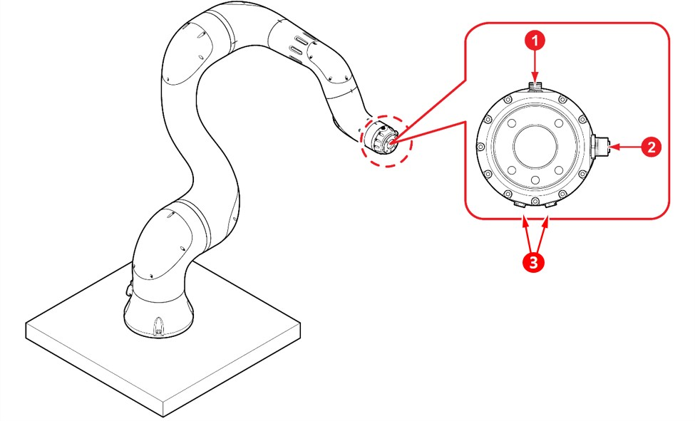

# 3.3.1 Tool flange connection point

Connect the tool to the connection port of the tool flange at the tip of the collaborative robot.

|    | EtherCAT connection port (T4031017041-000 (TE)): for EtherCAT communication                                 |
| :-----------------------------------: | ----------------------------------------------------------------------------------------------------------- |
|    | Tool I/O connection port (T4131012121-000 (TE)): for controlling tool motion                                |
|    | Air outlet (YL012, YL015): Pneumatic hoses (ø3.2, 2) are connected and used for the movement of the tools.  |
