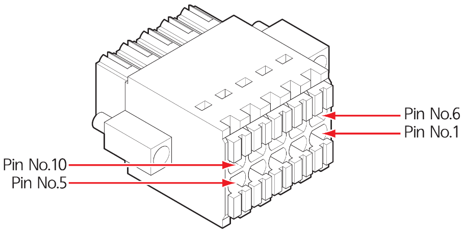
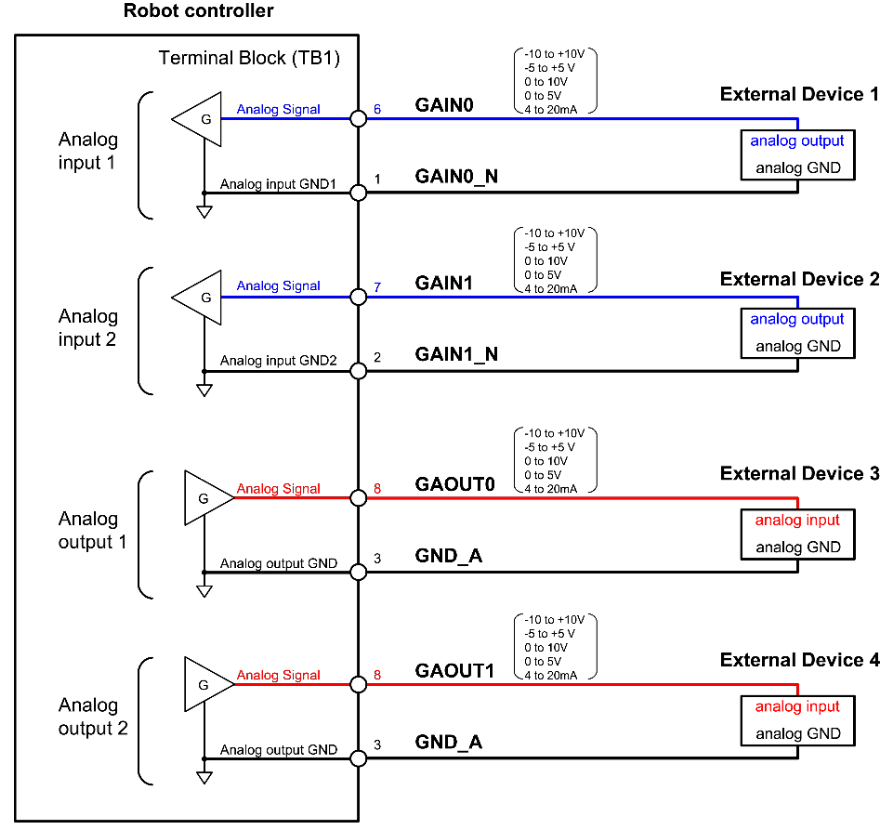

# 3.3.2.1 터미널 블록\(TB1\): 범용 아날로그 입출력 신호

범용 아날로그 입출력 신호는 터미널 블록 TB1을 통하여 2 개씩 연결할 수 있습니다. 입출력 범위는 설정에 따라 -10 ~ +10V, -5 ~ +5V, 0 ~ 10V, 0 ~ 5V, 4 ~ 20mA의 5종을 선택할 수 있습니다. 자세한 설정 방법은 “[**협동로봇 안전 기능 설명서**](%20https://hyundai-robotics.gitbook.io/cobot-safety-function/)”를 참조하십시오.

이 신호는 제어기 내부에 설치된 안전 제어 모듈\(SCM\)에 연결되어 있습니다. 신호 연결에 대한 자세한 내용은 “[**4.3.2.5 범용 아날로그 입출력 신호 연결\(TBAIO\)**](../../../4-maintenance/4-3-controller-check-maintenance/2-safety-control-module/5-tbaio.md)”을 참조하십시오.


**\[주의\]**

* BD6B3H DSW1의 6 ~ 10번을 모두 OFF로 설정하여 사용하십시오.

* BD6B3H DSW1의 6 ~ 10번을 모두 ON으로 설정하면 터미널 블록\(TB1\)의 1-6, 2-7, 3-4, 5-10번 핀들이 단락 상태가 되므로 주의하십시오.



