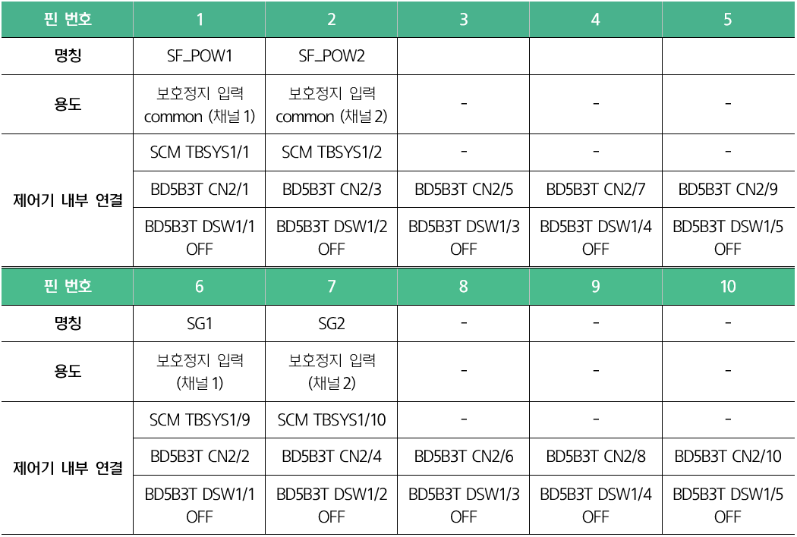
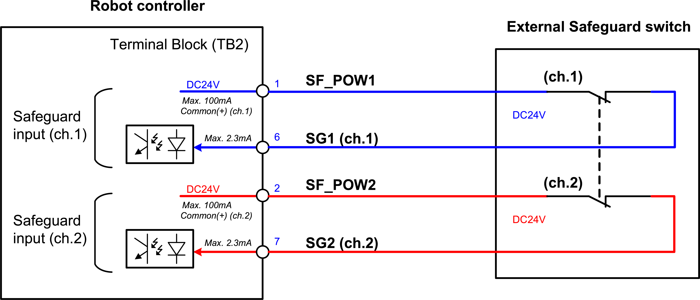

# 3.3.2.2 터미널 블록\(TB2\): 전용 안전 신호 입력

안전 가드와 같은 로봇 시스템 전용의 입출력 신호는 터미널 블록 TB2를 통하여 연결할 수 있습니다.

이 신호는 제어기 내부에 설치된 안전 제어 모듈\(SCM\)에 연결되어 있습니다. 신호 연결에 대한 자세한 내용은 “**4.3.2.3 안전 입출력 신호 연결\(TBSDI, TBSDO\)**”을 참조하십시오.


\[주의\]

* BD5B3T DSW1의 1 ~ 5번을 모두 OFF로 설정하여 사용하십시오.

* BD5B3T DSW1의 1 ~ 5번을 ON으로 설정하면 터미널 블록\(TB2\)의 1-6, 2-7, 3-4, 5-10번 핀들이 단락 상태가 되므로 주의하십시오.


