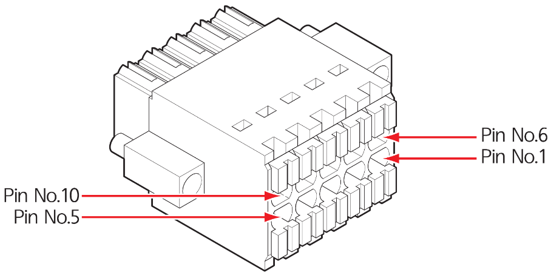

# 3.3.2.2 Terminal block \(TB2\): dedicated safety signal input

You can connect I/O signals dedicated to the robot system, such as the signals of safeguarding devices, through Terminal Block, TB2.

This signal is connected to the Safety control module installed inside the controller. For more details on signal connection, refer to “[**4.3.2.3 Safety I/O signal connection \(TBSDI, TBSDO\)**](../../../4-maintenance/4-3-controller-check-maintenance/2-safety-control-module/3-tbsdi-tbsdo.md)”


**\[Caution\]**

* BD5B3T is a lower version of BD6B3H, please be careful with DSW1. DSW1 removed from BD6B3H.

* Set all the pins from 1 to 5 of BD5B3T DSW1 at the OFF position.

* If you set all the pins from 1 to 5 of BD5B3T DSW1 at the ON position, the pin combinations of 1-6, 2-7, 3-4, and 5-10 of the Terminal Block \(TB2\) will be short-circuited. Therefore, pay attention not to set them at the ON position.



