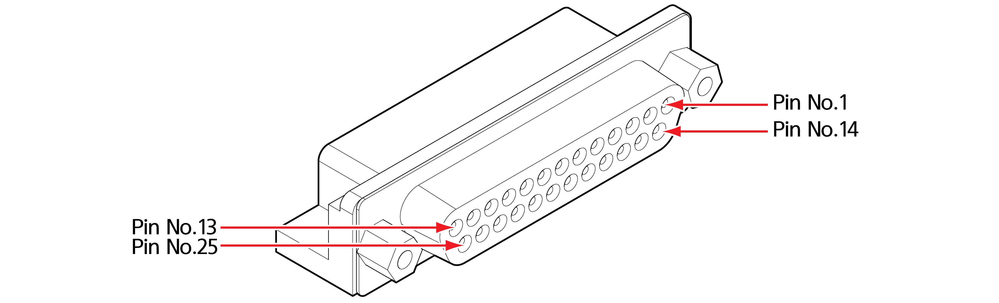
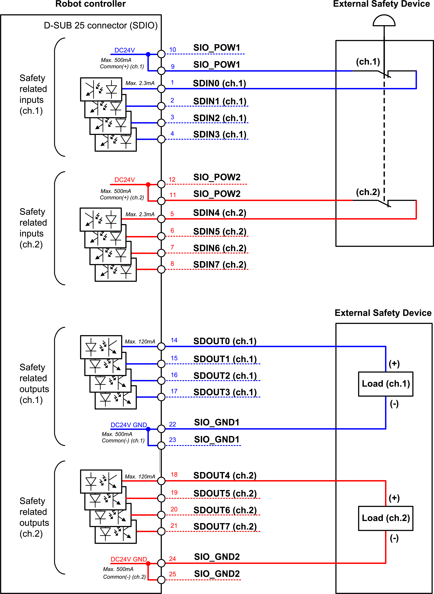
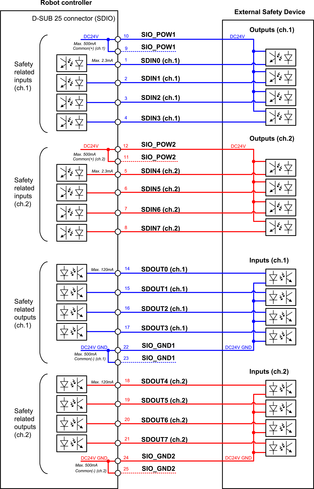

# 3.3.2.4 D-sub 25-pin connector \(SDIO\): common digital I/O

You can connect digital I/O signals for external safety signals, eight at a time, to the D-sub 24-pin connector \(SDIO\). For more details on signal connection, see “**General purpose safety I/O signals**.”

Set the safety I/O signals according to usages, referring to “[**Safety Function Manual for Collaborative Robots**](https://hyundai-robotics.gitbook.io/cobot-safety-function/v/english/).” For example, if you will not use the teach pendant and will use an enabling switch, connect it to the common safety signal input and assign input signals. The types of I/O signals that can be assigned are as follows:

* Input signals: STOP0, STOP1, STOP2, SOS, Reduced mode, Enable SW, Motor on, Mode switch-manual, Mode switch-auto, Mode switch-remote, Cartesian space \#1 - \#12

* Output signals: STO activation status, SOS activation status, Reduced mode activation status, Not reduced mode, Robot moving, Robot not stopping, Mode switch-manual, Mode switch-auto, Mode switch-remote, Cartesian space status \#1 - \#12, Violation alarm, TCP speed violation, TCP orientation violation, TCP force violation, Collision detection, Momentum violation, Power violation, SOS violation, Joint position violation, Joint speed violation, Cartesian space violation \#1 - \#12

<table>
  <thead>
    <tr>
      <th style="text-align:center">Pin number</th>
      <th style="text-align:center">1</th>
      <th style="text-align:center">2</th>
      <th style="text-align:center">3</th>
      <th style="text-align:center">4</th>
      <th style="text-align:center">5</th>
    </tr>
  </thead>
  <tbody>
    <tr>
      <td style="text-align:center">Name</td>
      <td style="text-align:center">SDIN0</td>
      <td style="text-align:center">SDIN1</td>
      <td style="text-align:center">SDIN2</td>
      <td style="text-align:center">SDIN3</td>
      <td style="text-align:center">SDIN4</td>
    </tr>
    <tr>
      <td style="text-align:center">Usage</td>
      <td style="text-align:center">
        
Safety signal input 0

        
(Channel 1)

      </td>
      <td style="text-align:center">
        
Safety signal input 1

        
(Channel 1)

      </td>
      <td style="text-align:center">
        
Safety signal input 2

        
(Channel 1)

      </td>
      <td style="text-align:center">
        
Safety signal input 3

        
(Channel 1)

      </td>
      <td style="text-align:center">
        
Safety signal input 4

        
(Channel 2)

      </td>
    </tr>
    <tr>
      <td style="text-align:center">Internal connections of the controller</td>
      <td style="text-align:center">
        
SCM TBSDI

        
Pin 9

      </td>
      <td style="text-align:center">
        
SCM TBSDI

        
Pin 10

      </td>
      <td style="text-align:center">
        
SCM TBSDI

        
Pin 11

      </td>
      <td style="text-align:center">
        
SCM TBSDI

        
Pin 12

      </td>
      <td style="text-align:center">
        
SCM TBSDI

        
Pin 13

      </td>
    </tr>
  </tbody>
</table>

<table>
  <thead>
    <tr>
      <th style="text-align:center">Pin number</th>
      <th style="text-align:center">6</th>
      <th style="text-align:center">7</th>
      <th style="text-align:center">8</th>
      <th style="text-align:center">9</th>
      <th style="text-align:center">10</th>
    </tr>
  </thead>
  <tbody>
    <tr>
      <td style="text-align:center">Name</td>
      <td style="text-align:center">SDIN5</td>
      <td style="text-align:center">SDIN6</td>
      <td style="text-align:center">SDIN7</td>
      <td style="text-align:center">SIO_POW1</td>
      <td style="text-align:center">SIO_POW2</td>
    </tr>
    <tr>
      <td style="text-align:center">Usage</td>
      <td style="text-align:center">
        
Safety signal input 5

        
(Channel 2)

      </td>
      <td style="text-align:center">
        
Safety signal input 6

        
(Channel 2)

      </td>
      <td style="text-align:center">
        
Safety signal input 7

        
(Channel 2)

      </td>
      <td style="text-align:center">Safety signal input common (Channel 1)</td>
      <td style="text-align:center">Safety signal input common (Channel 1)</td>
    </tr>
    <tr>
      <td style="text-align:center">Internal connections of the controller</td>
      <td style="text-align:center">
        
SCM TBSDI

        
Pin 14

      </td>
      <td style="text-align:center">
        
SCM TBSDI

        
Pin 15

      </td>
      <td style="text-align:center">
        
SCM TBSDI

        
Pin 16

      </td>
      <td style="text-align:center">SCM TBSDI
         Pin 1, 2</td>
      <td style="text-align:center">SCM TBSDI
         Pin 3, 4</td>
    </tr>
  </tbody>
</table>

<table>
  <thead>
    <tr>
      <th style="text-align:center">Pin number</th>
      <th style="text-align:center">11</th>
      <th style="text-align:center">12</th>
      <th style="text-align:center">13</th>
      <th style="text-align:center">14</th>
      <th style="text-align:center">15</th>
    </tr>
  </thead>
  <tbody>
    <tr>
      <td style="text-align:center">Name</td>
      <td style="text-align:center">SIO_POW3</td>
      <td style="text-align:center">SIO_POW4</td>
      <td style="text-align:center">-</td>
      <td style="text-align:center">SDOUT0</td>
      <td style="text-align:center">SDOUT1</td>
    </tr>
    <tr>
      <td style="text-align:center">Usage</td>
      <td style="text-align:center">Safety signal input common (Channel 2)</td>
      <td style="text-align:center">Safety signal input common (Channel 2)</td>
      <td style="text-align:center">-</td>
      <td style="text-align:center">Safety signal output 0 (Channel 1)</td>
      <td style="text-align:center">Safety signal output 1 (Channel 1)</td>
    </tr>
    <tr>
      <td style="text-align:center">Internal connections of the controller</td>
      <td style="text-align:center">SCM TBSDI
         Pin 5, 6</td>
      <td style="text-align:center">SCM TBSDI
         Pin 7, 8</td>
      <td style="text-align:center">-</td>
      <td style="text-align:center">
        
SCM TBSDO

        
Pin 9

      </td>
      <td style="text-align:center">
        
SCM TBSDO

        
Pin 10

      </td>
    </tr>
  </tbody>
</table>

<table>
  <thead>
    <tr>
      <th style="text-align:left">Pin number</th>
      <th style="text-align:left">16</th>
      <th style="text-align:left">17</th>
      <th style="text-align:left">18</th>
      <th style="text-align:left">19</th>
      <th style="text-align:left">20</th>
    </tr>
  </thead>
  <tbody>
    <tr>
      <td style="text-align:left">Internal of the controller</td>
      <td style="text-align:left">11</td>
      <td style="text-align:left">12</td>
      <td style="text-align:left">13</td>
      <td style="text-align:left">14</td>
      <td style="text-align:left">15</td>
    </tr>
    <tr>
      <td style="text-align:left">Name</td>
      <td style="text-align:left">SDOUT2</td>
      <td style="text-align:left">SDOUT3</td>
      <td style="text-align:left">SDOUT4</td>
      <td style="text-align:left">SDOUT5</td>
      <td style="text-align:left">SDOUT6</td>
    </tr>
    <tr>
      <td style="text-align:left">Usage</td>
      <td style="text-align:left">Safety signal output 2 (Channel 1)</td>
      <td style="text-align:left">Safety signal output 3 (Channel 1)</td>
      <td style="text-align:left">Safety signal output 4 (Channel 2)</td>
      <td style="text-align:left">Safety signal output 5 (Channel 2)</td>
      <td style="text-align:left">Safety signal output 6 (Channel 2)</td>
    </tr>
    <tr>
      <td style="text-align:left">Internal connections of the controller</td>
      <td style="text-align:left">
        
SCM TBSDO

        
Pin 11

      </td>
      <td style="text-align:left">
        
SCM TBSDO

        
Pin 12

      </td>
      <td style="text-align:left">
        
SCM TBSDO

        
Pin 13

      </td>
      <td style="text-align:left">
        
SCM TBSDO

        
Pin 14

      </td>
      <td style="text-align:left">
        
SCM TBSDO

        
Pin 15

      </td>
    </tr>
  </tbody>
</table>

<table>
  <thead>
    <tr>
      <th style="text-align:left">Pin number</th>
      <th style="text-align:left">21</th>
      <th style="text-align:left">22</th>
      <th style="text-align:left">23</th>
      <th style="text-align:left">24</th>
      <th style="text-align:left">25</th>
    </tr>
  </thead>
  <tbody>
    <tr>
      <td style="text-align:left">Internal of the controller</td>
      <td style="text-align:left">16</td>
      <td style="text-align:left">1, 2</td>
      <td style="text-align:left">3, 4</td>
      <td style="text-align:left">5, 6</td>
      <td style="text-align:left">7, 8</td>
    </tr>
    <tr>
      <td style="text-align:left">Name</td>
      <td style="text-align:left">SDOUT7</td>
      <td style="text-align:left">SIO_GND1</td>
      <td style="text-align:left">SIO_GND1</td>
      <td style="text-align:left">SIO_GND2</td>
      <td style="text-align:left">SIO_GND2</td>
    </tr>
    <tr>
      <td style="text-align:left">Usage</td>
      <td style="text-align:left">Safety signal output 7 (Channel 2)</td>
      <td style="text-align:left">Safety signal output common (Channel 1)</td>
      <td style="text-align:left">Safety signal output common (Channel 1)</td>
      <td style="text-align:left">Safety signal output common (Channel 2)</td>
      <td style="text-align:left">Safety signal output common (Channel 2)</td>
    </tr>
    <tr>
      <td style="text-align:left">Internal connections of the controller</td>
      <td style="text-align:left">
        
SCM TBSDO

        
Pin 16

      </td>
      <td style="text-align:left">SCM TBSDO
         Pin 1, 2</td>
      <td style="text-align:left">SCM TBSDO
         Pin 3, 4</td>
      <td style="text-align:left">SCM TBSDO
         Pin 5, 6</td>
      <td style="text-align:left">SCM TBSDO
         Pin 7, 8</td>
    </tr>
  </tbody>
</table>

This signal is connected to the Safety control module installed inside the controller. For more details on signal connection, refer to “[**4.3.2.3 Safety I/O signal connection \(TBSDI, TBSDO\)**](../../../4-maintenance/4-3-controller-check-maintenance/2-safety-control-module/3-tbsdi-tbsdo.md).”


**\[Caution\]**

* Separate safety signals and common I/O signals, and never connect safety signals to other PLCs than safety PLCs. If you connect safety signals to other PLCs, it will lead to the malfunction of the safety stop function and may cause safety accidents, including physical injuries.

* All the I/Os of safety grade are of redundancy structure. Make sure to separate the relevant channels to prevent signal faults from compromising the safety function.

* Make sure to power off the product before carrying out any types of wiring, termination, and electrical work.

* Hyundai Robotics will not take responsibility for product damages caused by the customer’s carelessness, unskillful operation, and other errors. Never arbitrarily modify, disassemble, or repair the product.

* Make sure to check the safety functions before robot installation and check for anomalies at regular intervals afterward.


