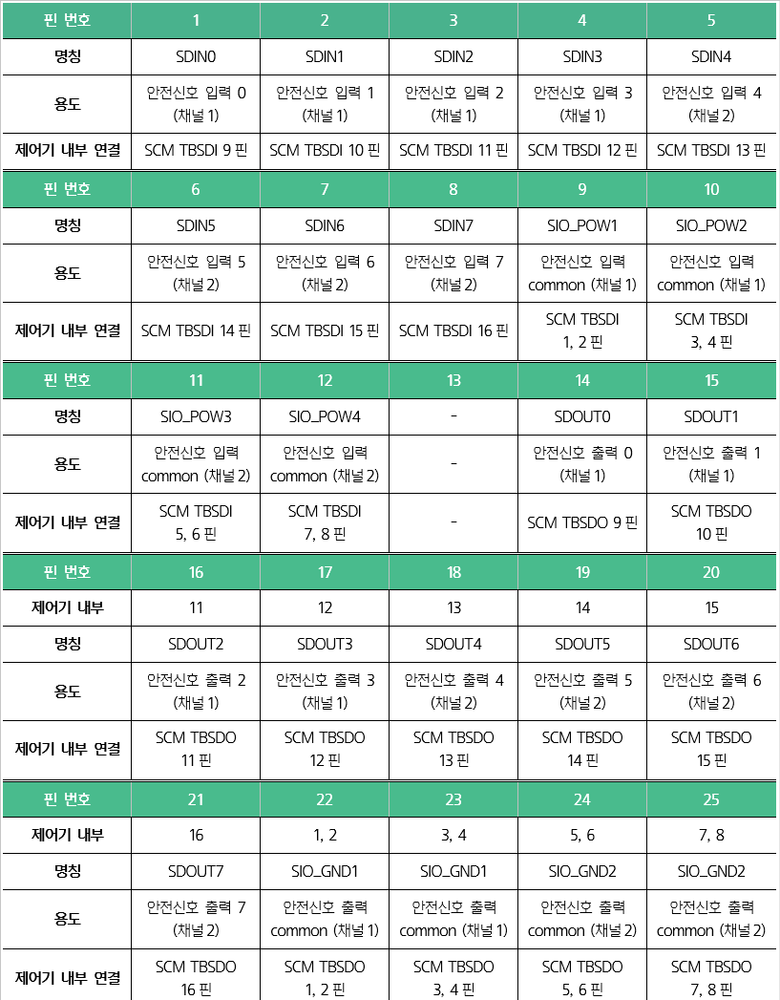

# 3.3.2.4 D-SUB 25 커넥터\(SDIO\): 범용 안전 신호 입출력

외부의 안전 신호용 디지털 입출력 신호는 D-SUB 24커넥터\(SDIO\)를 통하여 8개씩 연결할 수 있습니다. 비상 정지 장치, 보호\(방호\) 장치 등 협동로봇의 안전 시스템을 구성할 수 있습니다.

안전 입출력 신호는 용도에 따라 “협동로봇 기능 설명서”를 참조하여 설정하십시오. 예를 들어, 티치 펜던트를 사용하지 않거나 인에이블링 스위치를 추가할 경우에는 범용 안전 신호 입력에 배선하고 입력 신호를 할당합니다. 할당할 수 있는 입출력 신호의 종류는 다음과 같습니다.

* 입력 신호: STOP0, STOP1, STOP2, SOS, Reduced mode, Enable SW, Motor on, Mode switch-manual, Mode switch-auto, Mode switch-remote, Cartesian space\#1-\#12

* 출력 신호: STO activation status, SOS activation status, Reduce mode activation status, Not reduced mode, Robot moving, Robot not stopping, Mode switch-manual, Mode switch-auto, Mode switch-remote, Cartesian space status\#1-\#12, Violation alarm, TCP speed violation, TCP orientation violation, TCP force violation, Collision detection, Momentum violation, Power violation, SOS violation, Joint position violation, Joint speed violation, Cartesian space violation\#1-\#12

이 신호는 제어기 내부에 설치된 안전 제어 모듈\(SCM\)에 연결되어 있습니다. 신호 연결에 대한 자세한 내용은 “**4.3.2.3 안전 입출력 신호 연결\(TBSDI, TBSDO\)**”을 참조하십시오.


\[주의\]

* 안전 신호와 일반 I/O 신호를 구분하여 안전 PLC 이외의 다른 PLC에는 절대 안전 신호를 연결하지 마십시오. 안전 정지 기능이 오동작하여 신체에 상해를 입는 등 안전 사고가 발생할 수 있습니다.

* 모든 안전 등급의 입출력은 이중화되어 있습니다. 해당 채널은 반드시 분리하여 신호 장애로 인한 안전 기능의 미작동을 방지하십시오.

* 모든 유형의 배선, 단자 및 전기 관련 작업을 수행하기 전에는 반드시 제품의 전원을 차단하십시오.

* 당사에서는 고객 부주의, 조작 미숙 및 과실로 인한 제품의 손상 및 파손에 대해 책임지지 않습니다. 절대 무단으로 제품을 개조, 분해 및 수리하지 마십시오.

* 로봇을 설치하기 전에 안전 기능을 반드시 확인하고 정기적으로 이상 유무를 점검하십시오.


