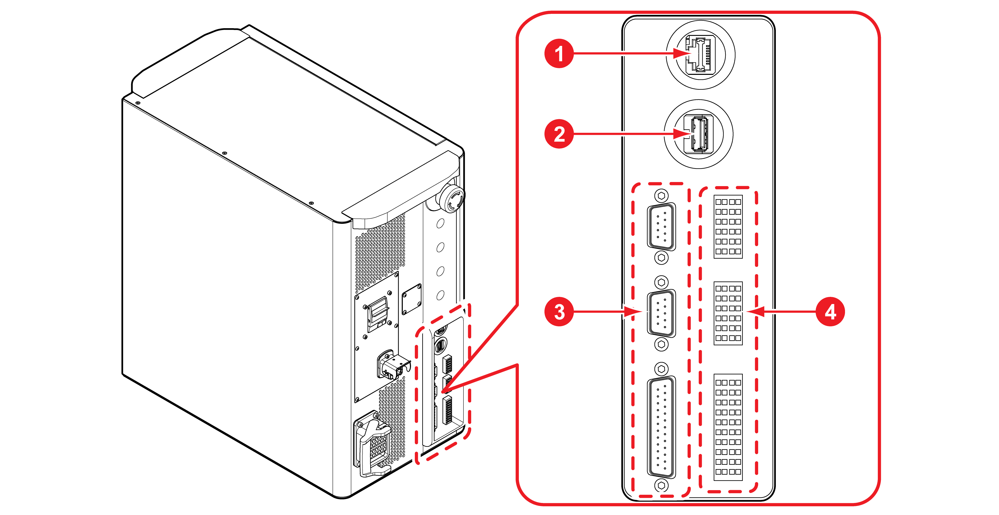

# 3.3.2 External device interface

You can connect various external devices to the external device interface on the front of the controller.

|                 **No**                | **　　　　　　　　　Description**                                                                                                                                    |
| :-----------------------------------: | ----------------------------------------------------------------------------------------------------------------------------------------------------------- |
|    | LAN port                                                                                                                                                    |
|    | USB port                                                                                                                                                    |
|    | 
D-SUB connectors
<ul><li>9-pin (COM1, COM2): serial communication (RS485, 422, 232)
</li><li>25-pin (SDIO): common digital I/O
</li></ul>            |
|    | 
Terminal blocks
<ul><li>TB1: common analog I/O
</li><li>TB2: dedicated safety signal input
</li><li>
TB3: system signal I/O


</li></ul> |


* The external device interface is described based on the composition of basic connections.
* If you wish to install additional optional items and connect them to the external device interface, you may change the composition of basic connections. For more details on the installation of additional optional items and the composition of connections, consult with our Customer Support Team.

