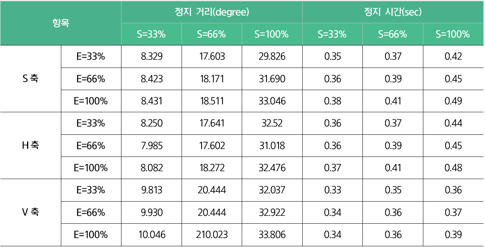
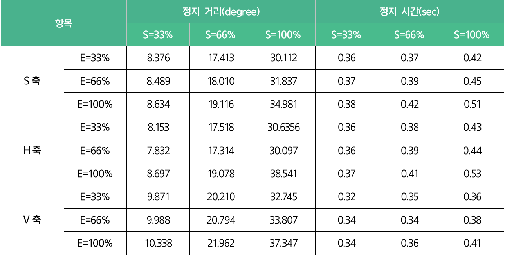
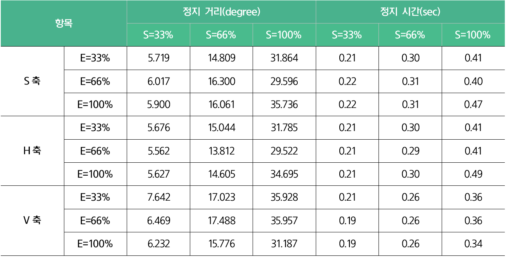
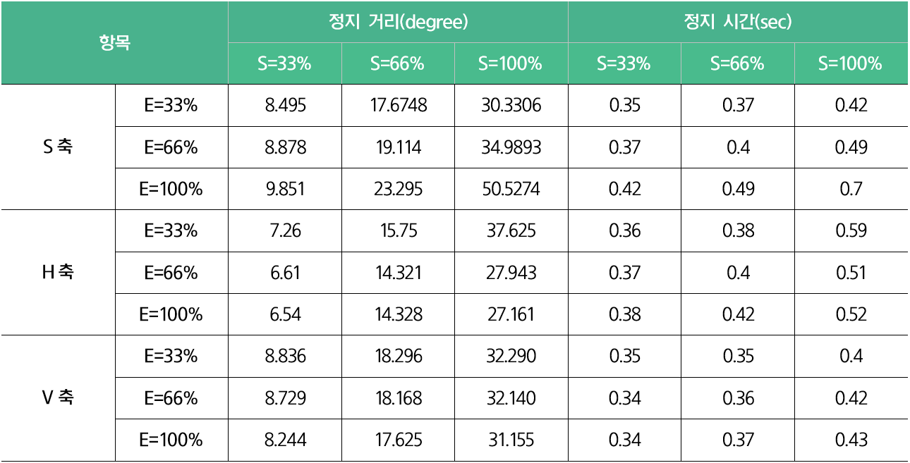
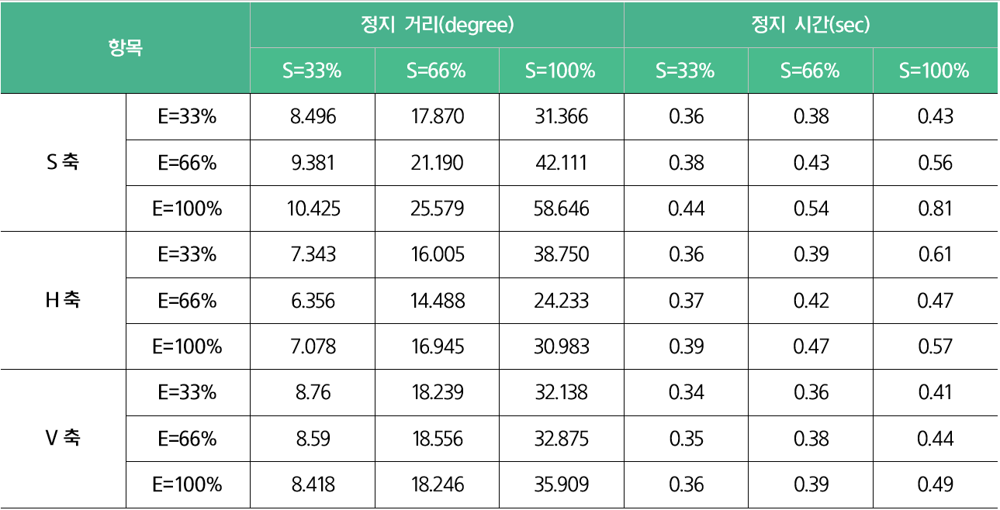
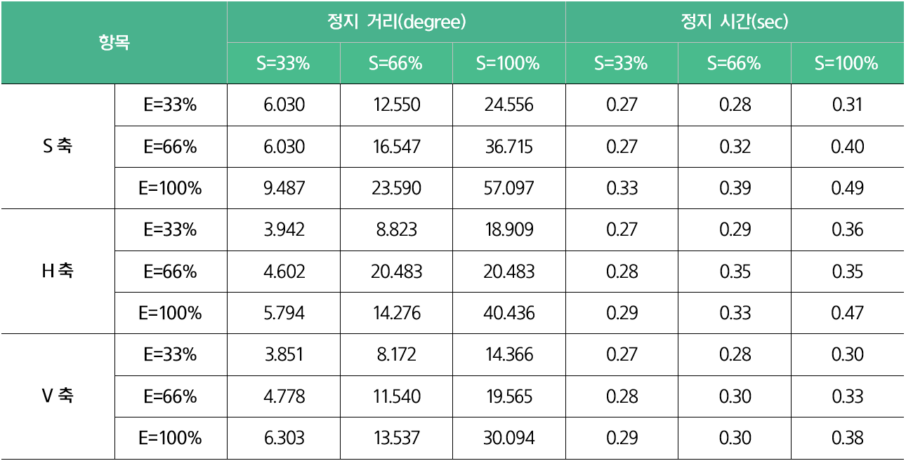
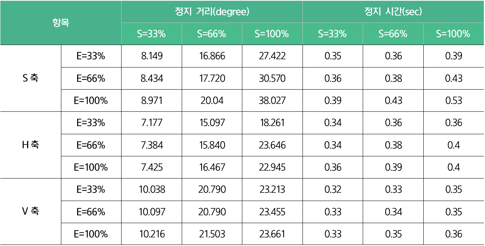
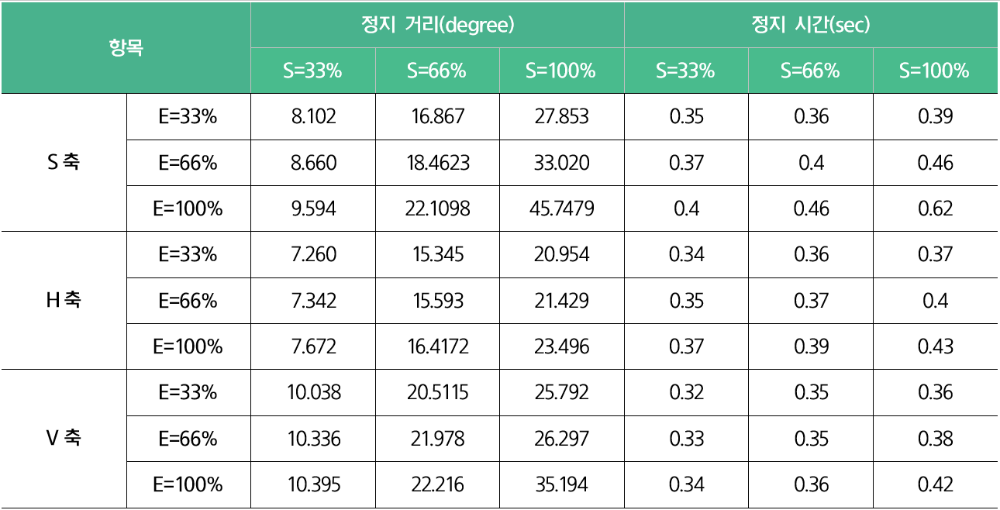
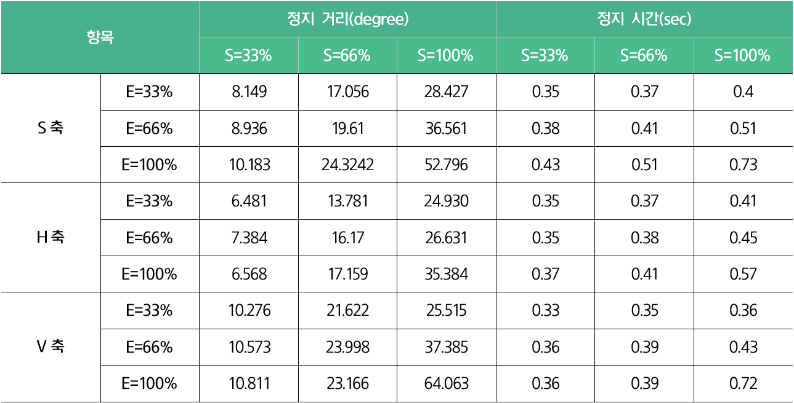

# 3.4.2 정지1 \(STOP1\)

STOP1 시, 축별 확장값과 속도에 따른 모델별 정지 거리와 정지 시간은 다음과 같습니다.

### YL005

* 확장\(Extension\): E=33%, 66%, 100%

* 속도\(Speed\): S=33%, 66%, 100%

* 부하\(Load\): L=33%

* 부하\(Load\): L=66%

* 부하\(Load\): L=100%

### YL012

* 확장\(Extension\): E=33%, 66%, 100%

* 속도\(Speed\): S=33%, 66%, 100%

* 부하\(Load\): L=33%

* 부하\(Load\): L=66%

* 부하\(Load\): L=100%

### YL015

* 확장\(Extension\): E=33%, 66%, 100%

* 속도\(Speed\): S=33%, 66%, 100%

* 부하\(Load\): L=33%

* 부하\(Load\): L=66%
  * 

* 부하\(Load\): L=100%

