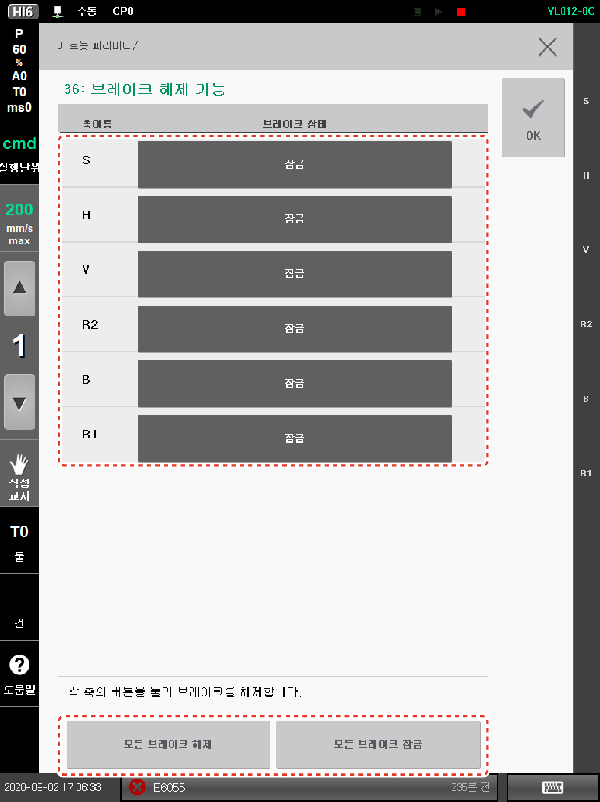

# 3.8 무동력 동작

비상 상황 또는 비정상 상황 발생 시, 위험 영역 내에 고립된 작업자의 비상 탈출을 위하여 로봇의 구동력을 제거하여 각 축을 움직일 수 있도록 설정할 수 있습니다 (Movement without dive power).


**\[주의]**

*   기구에 동력이 인가되지 않은 상황에서 로봇의 축을 풀 경우에는 축 처짐 또는 축 낙하가 발생할 수 있습니다. 안전을 위하여 크레인과 같이 축을 지지할 수 있는 장치를 이용하여 축을 고정시킨 후 작업을 수행하십시오.

* 비상 및 비정상 상황에 대처하기 위해, 로봇 시스템의 설치, 사용 및 보수를 행하는 모든 작업자는 반드시 무동력 동작에 대한 교육을 이수한 후에 로봇을 사용하십시오.


무동력 동작은 티치 펜던트의** \[브레이크 해제 기능]** 메뉴를 이용하여 사용할 수 있습니다.

1.  로봇 모터의 전원 공급을 차단한 상태에서 안전 입력을 복귀하십시오.

2.  티치 펜던트 화면의 **\[설정 > 3: 로봇 파라미터 > 36: 브레이크 해제 기능] **메뉴를 터치하십시오.

3. 로봇의 상태를 확인하고 원하는 축의 브레이크를 해제하십시오.

*   축별로 브레이크를 해제하려면, 원하는 축의** \[잠금]** 버튼을 터치하십시오.** \[잠금]** 버튼을 터치하고 있는 동안에만 해당 축의 브레이크가 해제됩니다.** \[잠금] **버튼을 놓으면 브레이크는 다시 잠깁니다.

* 모든 축의 브레이크를 한 번에 해제하려면, **\[모든 브레이크 해제]** 버튼을 터치하십시오.** \[모든 브레이크 잠김] **버튼을 터치하면 모든 축의 브레이크를 한 번에 잠깁니다.


**\[주의]**: 티치 펜던트의 **\[브레이크 해제 기능]** 메뉴에서만 축의 브레이크를 해제할 수 있습니다. 이 메뉴를 벗어나는 즉시 모든 브레이크는 잠깁니다.



