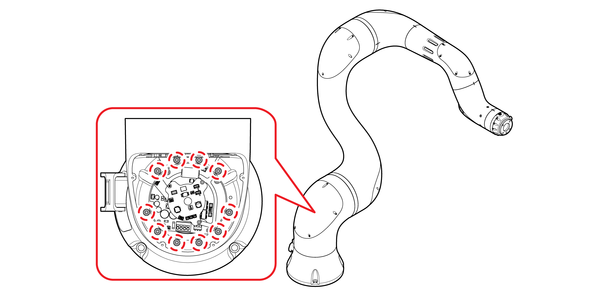
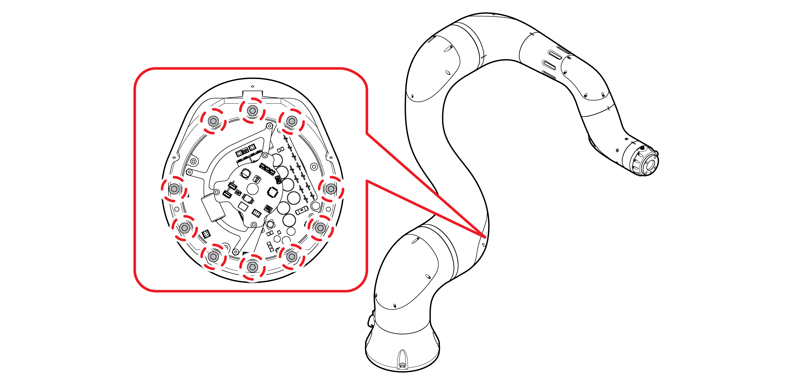
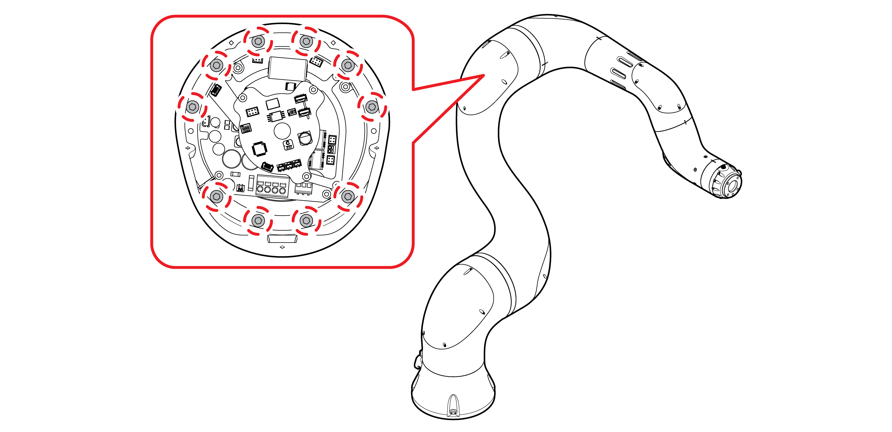
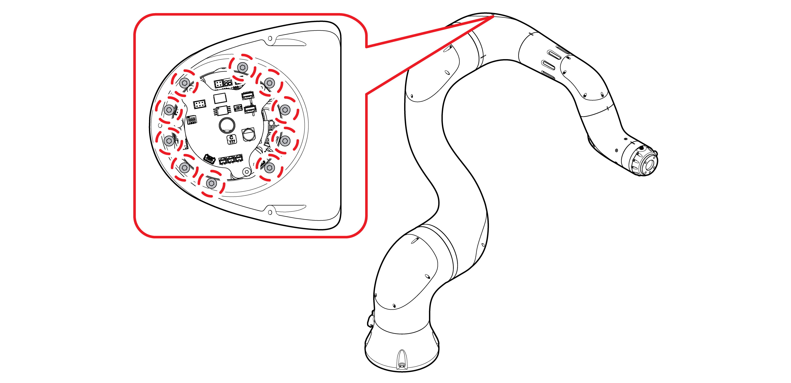
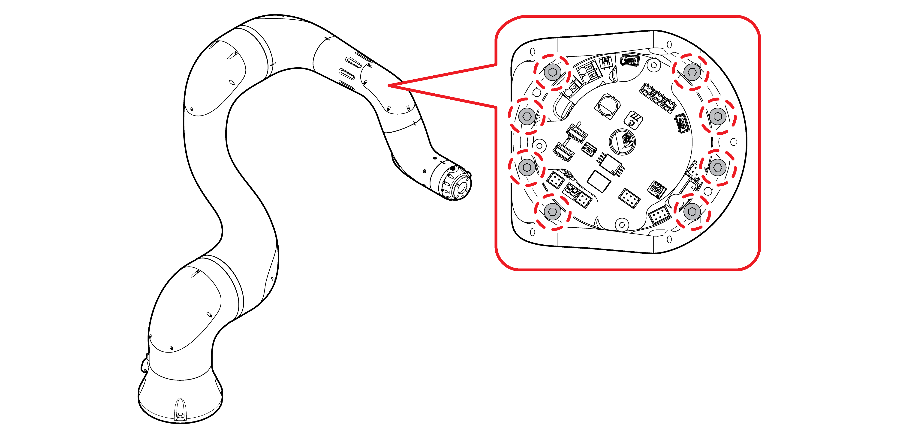
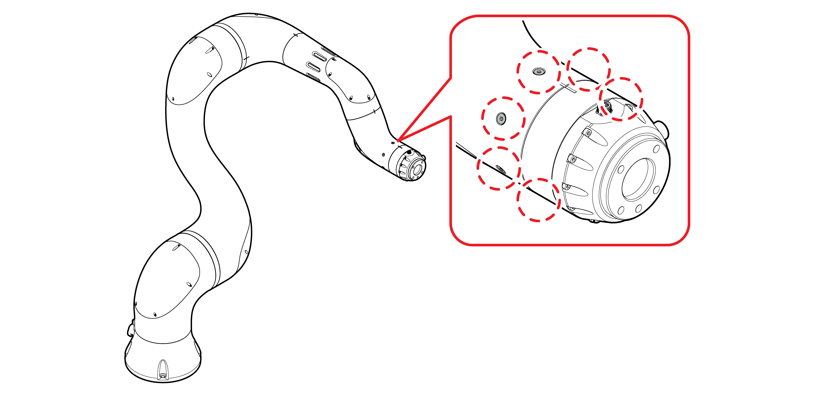

# 4.1.3 볼트 점검

주요 점검 볼트와 볼트의 권장 체결 토크를 확인하십시오. 점검 볼트는 로봇이 수행하는 작업에 따라 다르므로 자세한 내용은 고객지원팀에 문의하십시오.

토크 렌치를 이용하여 각 축의 통합 구동 모듈 취부 볼트를 적정 토크로 조인 후 페인트로 마킹하십시오.

* S축 점검 부위 - 볼트: 10 X M5-18 / 토크: 8.2 Nm \(83 kgf·cm\)

* H축 점검 부위 - 볼트: 10 X M6-20 / 토크: 13.82 Nm \(141 kgf·cm\)

* V축 점검 부위 - 볼트: 10 X M5-20 / 토크: 8.2 Nm \(83 kgf·cm\)

* R2축 점검 부위 - 볼트: 10 X M4-25 / 토크: 4.02 Nm \(41 kgf·cm\)

* B축 점검 부위 - 볼트: 8 X M4-20 / 토크: 4.02 Nm \(41 kgf·cm\)

* R1축 점검 부위 - 볼트: 6 X M4-10 접시머리\(12.9\) / 토크: 4.02 Nm \(41 kgf·cm\)

