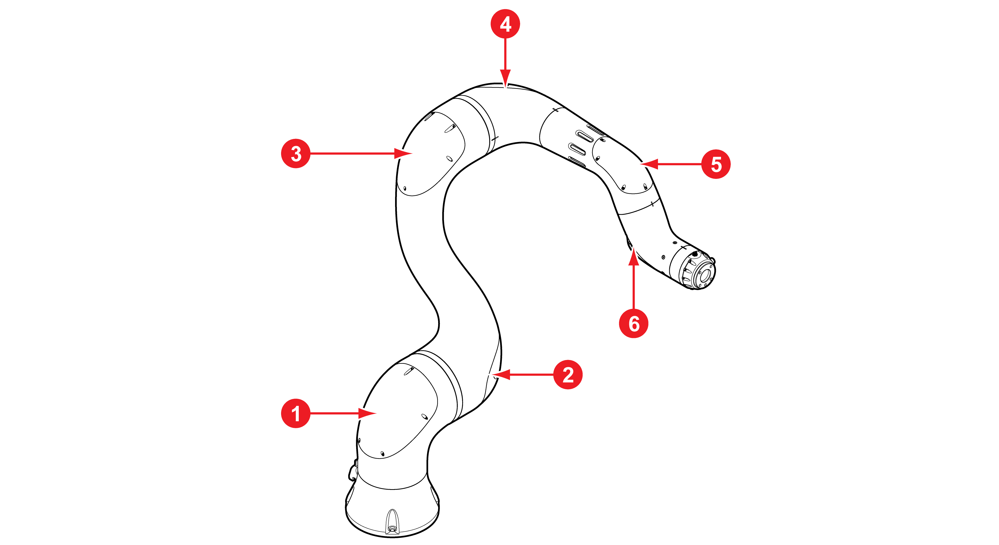

# 4.2.3 엔코더 백업 배터리 교체

시리얼 엔코더에 전용 배터리를 부착하여 제어기의 전원 공급 여부에 관계없이 각 축의 위치 데이터를 보존합니다. 배터리의 교체 주기는 2년입니다.

각 축의 배터리를 교체하는 방법은 다음과 같습니다.

1\. 제어기 전원이 켜져 있는 상태에서 비상 정지 스위치를 누르십시오.


**\[주의]**: 엔코더 보정 전에는 운전 준비 ON을 설정하고 티치 펜던트의 인에이블링 스위치를 2 \~ 3초간 눌러 전원 연결 여부를 확인하십시오.


2\. 각 축의 배터리 위치를 확인하고 토크 렌치로 볼트를 분리하여 프레임 커버를 분리하십시오.

|               **번호**               | **축** |          **커버**         |             **볼트**             |
| :--------------------------------: | :---: | :---------------------: | :----------------------------: |
|    |   S   |    LOWER FRAME COVER    | 
육각소켓볼트

(M3X6, 5개)
 |
|    |   H   | UPPER FRAME LOWER COVER | 
육각소켓볼트

(M3X6, 5개)
 |
|    |   V   | UPPER FRAME UPPER COVER | 
육각소켓볼트

(M3X6, 6개)
 |
|    |   R2  |     ARM FRAME COVER     | 
육각소켓볼트

(M3X6, 5개)
 |
|    |   B   |      ARM PIPE COVER     | 
육각소켓볼트

(M3X6, 6개)
 |
|    |   R1  |        HAND GRIP        |           M3 소경볼트(4개)          |

3\. 배터리의 단자 방향을 확인하고 새 배터리로 교체하십시오.


**\[주의]**

* 지정된 사양의 배터리(ER6C (AA 3.6 V) / 제조사: Maxcell)만 사용하십시오.
* 배터리의 단자 방향을 확인하여 제대로 끼우십시오.
* 배터리를 재활용하거나 함부로 버리지 마십시오. 해당 국가 또는 지역의 관련 규정 및 법규에 따라 산업용 폐기물로 처리해야 합니다.


4\. 각 축에 프레임 커버를 끼운 후 토크 렌치와 볼트를 이용해 고정하십시오.
