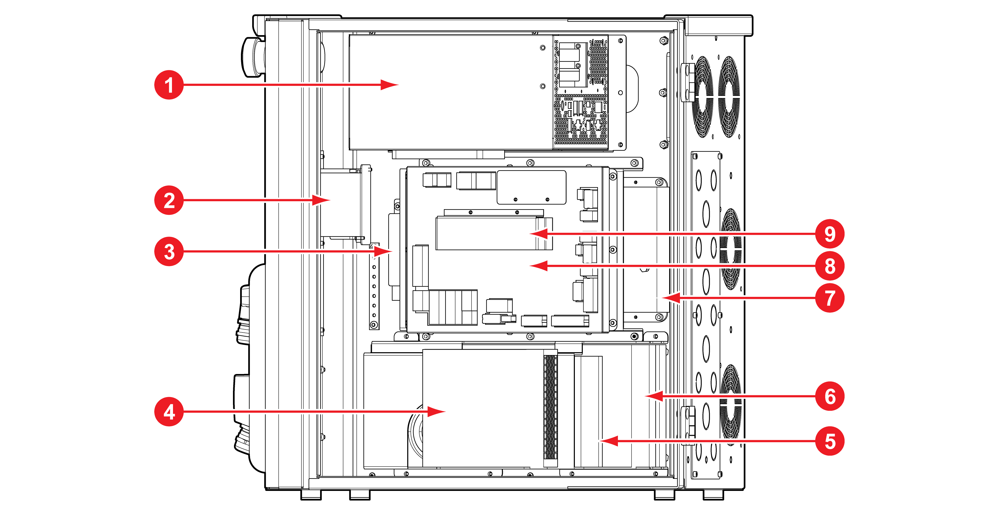

# 4.3.1 Internal structure

Identifying the structure and part names of the controller is useful for learning how to install and maintain it.

|                     **No**                     |            **Name**           |    ****   | **                                       **Description                                      |
| :--------------------------------------------: | :---------------------------: | :-------: | ------------------------------------------------------------------------------------------- |
|   |      Microcomputer module     | miniH6COM | This has overall control of the collaborative robot                                         |
|   |    Power switch and breaker   |    CP1    | This turns on/off the main power of the controller.                                         |
|   |          Noise filter         |    NF1    | This filters conductive noise.                                                              |
|   |          Buffer power         |   BUFFER  | This supplies power to the microcomputer module for a certain period in case of a blackout. |
|   |         Power supply 2        |   SMPS2   | This is the power source (48 V DC) of the joint actuator.                                   |
|   |         Power supply 1        |   SMPS1   | This is the power source (48 V DC) for the controlling.                                     |
|   | Regenerative discharge module |    RDM    | This discharges the regenerative power generated by the motor of the joint actuator.        |
|   |     Safety control module     |    SCM    | This controls the safety functions of the collaborative robot.                              |
|   |     Power precharge module    |    PPM    | This precharges the power for the joint actuator of the collaborative robot.                |
