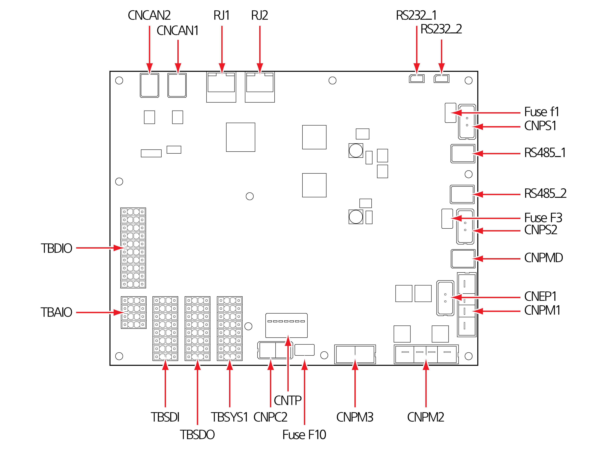

# 4.3.2.1 Connection and display

The connector layout, usages, and connecting devices used by the SCM are as follows:

|   |
| - |

| **Connector** | **                                       Usage**                                                                                                     |            **External connecting device**            |
| :-----------: | ---------------------------------------------------------------------------------------------------------------------------------------------------- | :--------------------------------------------------: |
|    CNPS1, 2   | 
Power input for the safety circuit, 24 V DC

(Channels 1 and 2)
                                                                          |                 Power supply (SMPS2)                 |
|     CNCAN1    | Data communication (exchange of torque data) with the torque sensors (Channel 1) of the mechanical parts                                             |         Robot cable connection terminal (CNM)        |
|     CNCAN2    | Data communication (exchange of torque and position data) with the torque sensors (Channel 2) and encoder (Channel 2) of the mechanical parts        |              Robot cable connector (CNM)             |
|      RJ1      | EtherCAT communication port                                                                                                                          |              Robot cable connector (CNM)             |
|      RJ2      | EtherCAT communication port                                                                                                                          |           Microcomputer module (miniH6COM)           |
|     CNPM1     | Power input for driving motors of the mechanical parts (48 V DC)                                                                                     |                 Power supply (SMPS1)                 |
|     CNPM2     | Power output for driving motors of the mechanical parts (48 V DC)                                                                                    |              Robot cable connector (CNM)             |
|     CNPM3     | Power output for charging the motor driving power lines (48 V DC)                                                                                    |             Power precharge module (PPM)             |
|     CNEP1     | Power input for charging the motor driving power lines (48 V DC)                                                                                     |              Safety control module (SCM)             |
|     CNRDM     | Exchange of information on the state of regenerative discharge action                                                                                |          Regenerative discharge module (RDM)         |
|     CNPC2     | Power input for I/O                                                                                                                                  |                 Power supply (SMPS2)                 |
|     TBSYS1    | Input for the emergency stop switch and protective stop switch (safeguard), control of power charging function, and connection of monitoring signals | External safety switch, power precharge module (PPM) |
|     TBSDO     | Connection of safety output signals                                                                                                                  |                     Safety device                    |
|     TBSDI     | Connection of safety input signals                                                                                                                   |                     Safety device                    |
|     TBAIO     | Connection of general analog I/O signals                                                                                                             |                General analog devices                |
|     TBDIO     | Connection of general digital I/O signals                                                                                                            |                General digital devices               |
|  RS485\_1, 2  | 
Connection of RS-485 serial communication

(reserved function)
                                                                           |                           -                          |
|  RS232\_1, 2  | 
Connection of RS-232 serial communication

(reserved function)
                                                                           |                           -                          |

