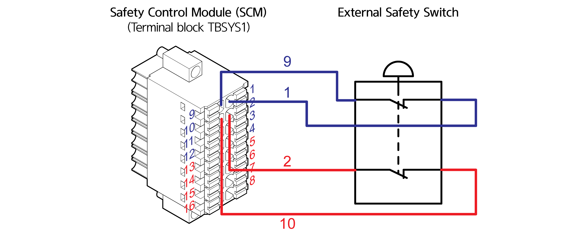

# 4.3.2.2 로봇 시스템용 입출력 신호 연결\(TBSYS1\)

로봇 시스템 전용의 입출력 신호는 안전 제어 모듈의 터미널 블록 TBSYS1을 통하여 연결됩니다.

\* 3 ~ 8, 11 ~ 16번 핀은 제어 시스템 내부에서 전용 신호로 사용됩니다.

<table>
  <thead>
    <tr>
      <th style="text-align:center"><b>&#xBC88;&#xD638;</b>
      </th>
      <th style="text-align:center"><b>&#xC774;&#xB984;</b>
      </th>
      <th style="text-align:left"><b>                       &#xC6A9;&#xB3C4;</b>
      </th>
      <th style="text-align:center"><b>&#xBC88;&#xD638;</b>
      </th>
      <th style="text-align:center"><b>&#xC774;&#xB984;</b>
      </th>
      <th style="text-align:left"><b>                        &#xC6A9;&#xB3C4;</b>
      </th>
    </tr>
  </thead>
  <tbody>
    <tr>
      <td style="text-align:center">1</td>
      <td style="text-align:center">SF_POW1</td>
      <td style="text-align:left">
        
&#xBCF4;&#xD638; &#xC815;&#xC9C0; &#xC785;&#xB825;

        
common (&#xCC44;&#xB110;1)

      </td>
      <td style="text-align:center">9</td>
      <td style="text-align:center">SG1</td>
      <td style="text-align:left">&#xBCF4;&#xD638; &#xC815;&#xC9C0; &#xC785;&#xB825;(&#xCC44;&#xB110;1)</td>
    </tr>
    <tr>
      <td style="text-align:center">2</td>
      <td style="text-align:center">SF_POW2</td>
      <td style="text-align:left">
        
&#xBCF4;&#xD638; &#xC815;&#xC9C0; &#xC785;&#xB825;

        
common (&#xCC44;&#xB110;2)

      </td>
      <td style="text-align:center">10</td>
      <td style="text-align:center">SG2</td>
      <td style="text-align:left">&#xBCF4;&#xD638; &#xC815;&#xC9C0; &#xC785;&#xB825;(&#xCC44;&#xB110;2)</td>
    </tr>
    <tr>
      <td style="text-align:center">3</td>
      <td style="text-align:center">SF_POW1</td>
      <td style="text-align:left">
        
&#xBE44;&#xC0C1; &#xC815;&#xC9C0; &#xC785;&#xB825;

        
common (&#xCC44;&#xB110;1)

        
- &#xC81C;&#xC5B4;&#xD568; &#xBE44;&#xC0C1; &#xC815;&#xC9C0; &#xC2A4;&#xC704;&#xCE58;
          &#xC5F0;&#xACB0;

      </td>
      <td style="text-align:center">11</td>
      <td style="text-align:center">ES1</td>
      <td style="text-align:left">
        
&#xBE44;&#xC0C1; &#xC815;&#xC9C0; &#xC785;&#xB825;(&#xCC44;&#xB110;1)

        
- &#xC81C;&#xC5B4;&#xD568; &#xBE44;&#xC0C1; &#xC815;&#xC9C0; &#xC2A4;&#xC704;&#xCE58;
          &#xC5F0;&#xACB0;

      </td>
    </tr>
    <tr>
      <td style="text-align:center">4</td>
      <td style="text-align:center">SF_POW2</td>
      <td style="text-align:left">
        
&#xBE44;&#xC0C1; &#xC815;&#xC9C0; &#xC785;&#xB825;

        
common (&#xCC44;&#xB110;2)

        
- &#xC81C;&#xC5B4;&#xD568; &#xBE44;&#xC0C1; &#xC815;&#xC9C0; &#xC2A4;&#xC704;&#xCE58;
          &#xC5F0;&#xACB0;

      </td>
      <td style="text-align:center">12</td>
      <td style="text-align:center">ES2</td>
      <td style="text-align:left">
        
&#xBE44;&#xC0C1; &#xC815;&#xC9C0; &#xC785;&#xB825;(&#xCC44;&#xB110;2)

        
- &#xC81C;&#xC5B4;&#xD568; &#xBE44;&#xC0C1; &#xC815;&#xC9C0; &#xC2A4;&#xC704;&#xCE58;
          &#xC5F0;&#xACB0;

      </td>
    </tr>
    <tr>
      <td style="text-align:center">5</td>
      <td style="text-align:center">IN_POW1</td>
      <td style="text-align:left">PRIN &#xC785;&#xB825; common</td>
      <td style="text-align:center">13</td>
      <td style="text-align:center">/PRIN</td>
      <td style="text-align:left">Precharge &#xB9B4;&#xB808;&#xC774; &#xC0C1;&#xD0DC; &#xC785;&#xB825;</td>
    </tr>
    <tr>
      <td style="text-align:center">6</td>
      <td style="text-align:center">IN_POW2</td>
      <td style="text-align:left">&#xC608;&#xBE44; &#xC2E0;&#xD638; &#xC785;&#xB825; common</td>
      <td style="text-align:center">14</td>
      <td style="text-align:center">RSV_IN2</td>
      <td style="text-align:left">&#xC608;&#xBE44; &#xC2E0;&#xD638; &#xC785;&#xB825;</td>
    </tr>
    <tr>
      <td style="text-align:center">7</td>
      <td style="text-align:center">SF_GND1</td>
      <td style="text-align:left">PRON &#xCD9C;&#xB825; common</td>
      <td style="text-align:center">15</td>
      <td style="text-align:center">/PRON</td>
      <td style="text-align:left">Precharge &#xB9B4;&#xB808;&#xC774; &#xB3D9;&#xC791; &#xCD9C;&#xB825;</td>
    </tr>
    <tr>
      <td style="text-align:center">8</td>
      <td style="text-align:center">SF_GND2</td>
      <td style="text-align:left">&#xC608;&#xBE44; &#xC2E0;&#xD638; &#xCD9C;&#xB825; common</td>
      <td style="text-align:center">16</td>
      <td style="text-align:center">RSV_OUT2</td>
      <td style="text-align:left">&#xC608;&#xBE44; &#xC2E0;&#xD638; &#xCD9C;&#xB825;</td>
    </tr>
  </tbody>
</table>

