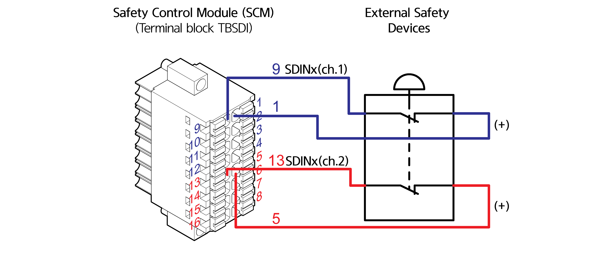

# 4.3.2.3 안전 입출력 신호 연결\(TBSDI, TBSDO\)

안전 제어 모듈의 안전 입력 신호는 터미널 블록 TBSDI를 통하여 비상 정지 스위치 및 안전 가드 입력을 받습니다.

|  |
| :--- |

| **번호** | **이름** | **용도** | **번호** | **이름** | **용도** |
| :--- | :---: | :---: | :---: | :---: | :---: |
| 1 | SIO\_POW1 | 안전 신호 입력 common \(채널1\) | 9 | SDIN0 | 안전 신호 입력 0\(채널1\) |
| 2 | SIO\_POW1 | 안전 신호 입력 common \(채널1\) | 10 | SDIN1 | 안전 신호 입력 1\(채널1\) |
| 3 | SIO\_POW1 | 안전 신호 입력 common \(채널1\) | 11 | SDIN2 | 안전 신호 입력 2\(채널1\) |
| 4 | SIO\_POW1 | 안전 신호 입력 common \(채널1\) | 12 | SDIN3 | 안전 신호 입력 3\(채널1\) |
| 5 | SIO\_POW2 | 안전 신호 입력 common \(채널2\) | 13 | SDIN4 | 안전 신호 입력 4\(채널2\) |
| 6 | SIO\_POW2 | 안전 신호 입력 common \(채널2\) | 14 | SDIN5 | 안전 신호 입력 5\(채널2\) |
| 7 | SIO\_POW2 | 안전 신호 입력 common \(채널2\) | 15 | SDIN6 | 안전 신호 입력 6\(채널2\) |
| 8 | SIO\_POW2 | 안전 신호 입력 common \(채널2\) | 16 | SDIN7 | 안전 신호 입력 7\(채널2\) |

