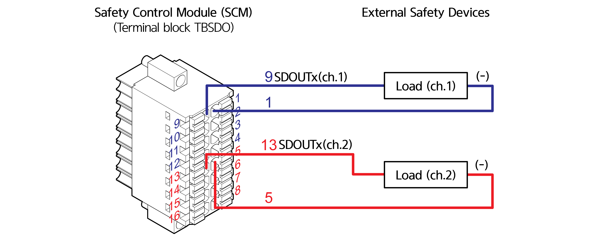

# 4.3.2.3 안전 입출력 신호 연결(TBSDI, TBSDO)

안전 제어 모듈의 안전 입력 신호는 터미널 블록 TBSDI를 통하여 비상 정지 스위치 및 안전 가드 입력을 받습니다.

| **번호** |  **이름**  | 　　　　　　　**용도**         |
| :----: | :------: | --------------------- |
|    1   | SIO_POW1 | 안전 신호 입력 common (채널1) |
|    2   | SIO_POW1 | 안전 신호 입력 common (채널1) |
|    3   | SIO_POW1 | 안전 신호 입력 common (채널1) |
|    4   | SIO_POW1 | 안전 신호 입력 common (채널1) |
|    5   | SIO_POW2 | 안전 신호 입력 common (채널2) |
|    6   | SIO_POW2 | 안전 신호 입력 common (채널2) |
|    7   | SIO_POW2 | 안전 신호 입력 common (채널2) |
|    8   | SIO_POW2 | 안전 신호 입력 common (채널2) |
|    9   |   SDIN0  | 안전 신호 입력 0(채널1)       |
|   10   |   SDIN1  | 안전 신호 입력 1(채널1)       |
|   11   |   SDIN2  | 안전 신호 입력 2(채널1)       |
|   12   |   SDIN3  | 안전 신호 입력 3(채널1)       |
|   13   |   SDIN4  | 안전 신호 입력 4(채널2)       |
|   14   |   SDIN5  | 안전 신호 입력 5(채널2)       |
|   15   |   SDIN6  | 안전 신호 입력 6(채널2)       |
|   16   |   SDIN7  | 안전 신호 입력 7(채널2)       |

그리고 안전 제어 모듈의 안전 출력 신호는 터미널 블록 TBSDO를 통하여 응용에 필요한 안전 장치로 출력합니다.

| **번호** |  **이름**  | 　　　　　　　**용도**         |
| :----: | :------: | --------------------- |
|    1   | SIO_GND1 | 안전 신호 출력 common (채널1) |
|    2   | SIO_GND1 | 안전 신호 출력 common (채널1) |
|    3   | SIO_GND1 | 안전 신호 출력 common (채널1) |
|    4   | SIO_GND1 | 안전 신호 출력 common (채널1) |
|    5   | SIO_GND2 | 안전 신호 출력 common (채널2) |
|    6   | SIO_GND2 | 안전 신호 출력 common (채널2) |
|    7   | SIO_GND2 | 안전 신호 출력 common (채널2) |
|    8   | SIO_GND2 | 안전 신호 출력 common (채널2) |
|    9   |  SDOUT0  | 안전 신호 출력 0(채널1)       |
|   10   |  SDOUT1  | 안전 신호 출력 1(채널1)       |
|   11   |  SDOUT2  | 안전 신호 출력 2(채널1)       |
|   12   |  SDOUT3  | 안전 신호 출력 3(채널1)       |
|   13   |  SDOUT4  | 안전 신호 출력 4(채널2)       |
|   14   |  SDOUT5  | 안전 신호 출력 5(채널2)       |
|   15   |  SDOUT6  | 안전 신호 출력 6(채널2)       |
|   16   |  SDOUT7  | 안전 신호 출력 7(채널2)       |
