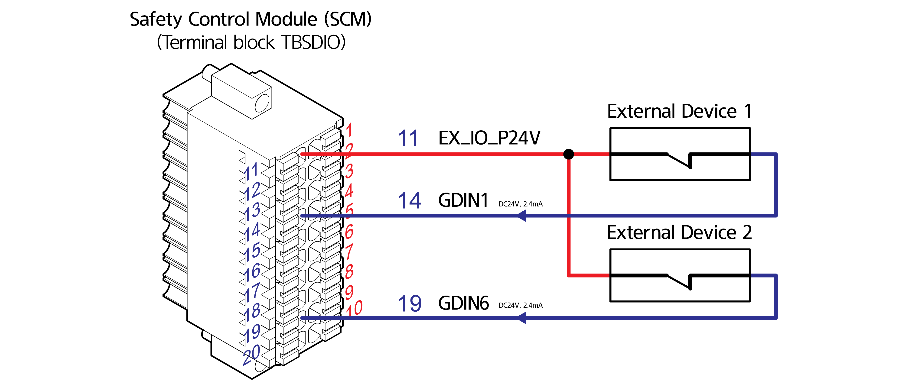
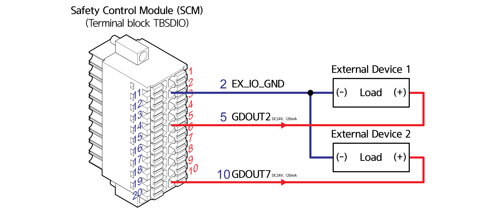

# 4.3.2.4 Connection of common digital I/O signals (TBDIO)

Common digital input signals are connected through Terminal Block, TBDIO (eight signals at the maximum can be connected). In the following example, External Device is input to GDIN1, and External Device 2 is input to GDIN6.

Common digital output signals are connected through Terminal Block, TBDIO (eight at the maximum). In the following example, the load of External Device 1 is operated through the output to GDOUT2, and the load of External Device 2 is operated through the output to GDOUT7.

| **No** |  **Name**  | **                                     Usage** |
| :----: | :--------: | ---------------------------------------------- |
|    1   | EX_IO_P24V | Common digital signal power                    |
|    2   |  EX_IO_GND | Common digital signal power GND                |
|    3   |   GDOUT0   | Common digital signal output 0                 |
|    4   |   GDOUT1   | Common digital signal output 1                 |
|    5   |   GDOUT2   | Common digital signal output 2                 |
|    6   |   GDOUT3   | Common digital signal output 3                 |
|    7   |   GDOUT4   | Common digital signal output 4                 |
|    8   |   GDOUT5   | Common digital signal output 5                 |
|    9   |   GDOUT6   | Common digital signal output 6                 |
|   10   |   GDOUT7   | Common digital signal output 7                 |
|   11   | EX_IO_P24V | Common digital signal power                    |
|   12   |  EX_IO_GND | Common digital signal power GND                |
|   13   |    GDIN0   | Common digital signal input 0                  |
|   14   |    GDIN1   | Common digital signal input 1                  |
|   15   |    GDIN2   | Common digital signal input 2                  |
|   16   |    GDIN3   | Common digital signal input 3                  |
|   17   |    GDIN4   | Common digital signal input 4                  |
|   18   |    GDIN5   | Common digital signal input 5                  |
|   19   |    GDIN6   | Common digital signal input 6                  |
|   20   |    GDIN7   | Common digital signal input 7                  |

| **** |
| :--: |
