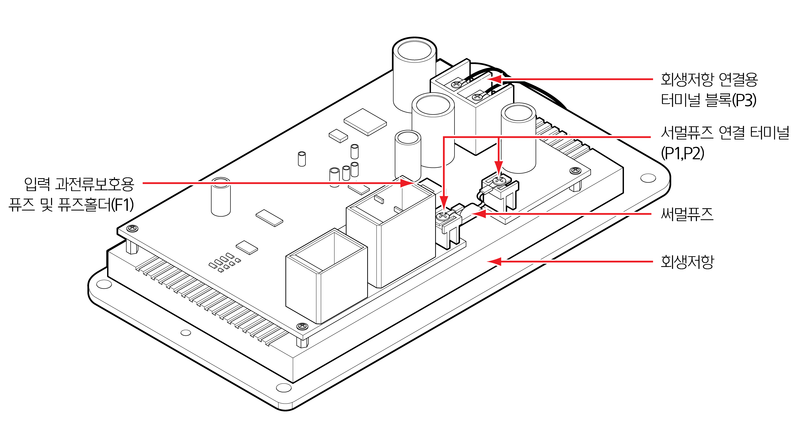

# 4.3.4.2 주요 부품 정보

회생 방전 보드에는 과전류에 대한 부품의 보호를 위해 퓨즈 및 회생저항을 사용합니다. 퓨즈는 보드의 상단과 회생저항 상단에, 저항은 보드의 하단에 부착됩니다. 내부 구성과 구성품들의 사양은 다음의 그림 및 표를 참조하십시오.

|   |
| - |

|     **부품**     | **                                            용도** |  **사양**  |
| :------------: | -------------------------------------------------- | :------: |
|      써멀 퓨즈     | 회생 동작 과전류 및 회생 저항 과열 보호                            | 15A, 93℃ |
| 입력단 과전류 보호용 퓨즈 | 입력 전원 과전류 보호                                       | 58V, 20A |
|      회생 저항     | 회생 동작을 위한 방전용 저항                                   | 5Ω, 100W |

