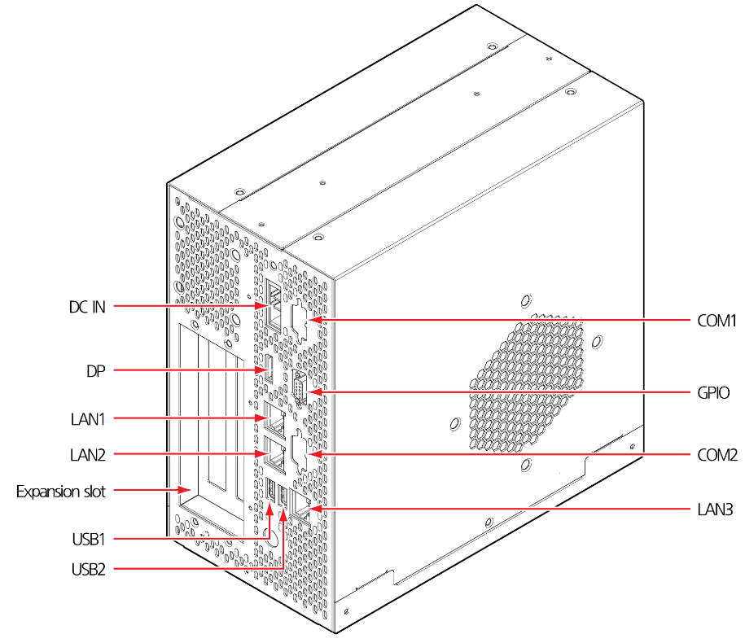

# 4.3.5 Microcomputer module

The microcomputer module (miniH6COM, EBC-GF53) drives and controls the collaborative robot based on the Hi6 control platform. For more details on this module, see “[**Operation Manual for Hi6 Controllers.**](https://hyundai-robotics.gitbook.io/hi6-operation-manual/v/op-english/)”

The composition of the external interface, COM ports, and power connector of the microcomputer module is as follows:

|     **Port**     |         Usage        |   Specification  | **Count** |
| :--------------: | :------------------: | :--------------: | :-------: |
|        DP        |        Display       |   Display Port   |     1     |
| LAN1, LAN2, LAN3 |       Wired LAN      |     Giga LAN     |     3     |
|    USB1, USB2    |          USB         |      USB2.0      |     2     |
|    COM1, COM2    | Serial communication |  RS-232/422/485  |     2     |
|       GPIO       |      Digital I/O     |  8 bits, DSUB-9  |     1     |
|       DC IN      |      Power input     | DC12 \~ 24V, 10A |     1     |
|         -        |    Extension slot    |   PCIe x1, PCI   |     2     |

|                     **No**                    |       **Name**      |                     **No**                    |  **Name**  |
| :-------------------------------------------: | :-----------------: | :-------------------------------------------: | :--------: |
|  | COMn\_422\_485\_TX- |  |  COMn_DSR# |
|  | COMn\_422\_485\_TX+ |  |  COMn_RTS# |
|  |    COMn\_422\_RX+   |  |  COMn_CTS# |
|  |    COMn\_422\_RX-   |  | COMn_RI_V# |
|  |         GND         |                                               |            |

|                     **No**                    |  **Name**  |                     **No**                    |  **Name**  |
| :-------------------------------------------: | :--------: | :-------------------------------------------: | :--------: |
|  | GPIO_GPIO0 |  | GPIO_GPIO4 |
|  | GPIO_GPIO1 |  | GPIO_GPIO5 |
|  | GPIO_GPIO2 |  | GPIO_GPIO6 |
|  | GPIO_GPIO3 |  | GPIO_GPIO7 |
|  |     GND    |                                               |            |

|     |
| :-: |

|                     **No**                    | **Name** |
| :-------------------------------------------: | :------: |
|  |   DC24V  |
|  |    FG    |
|  |    GND   |

