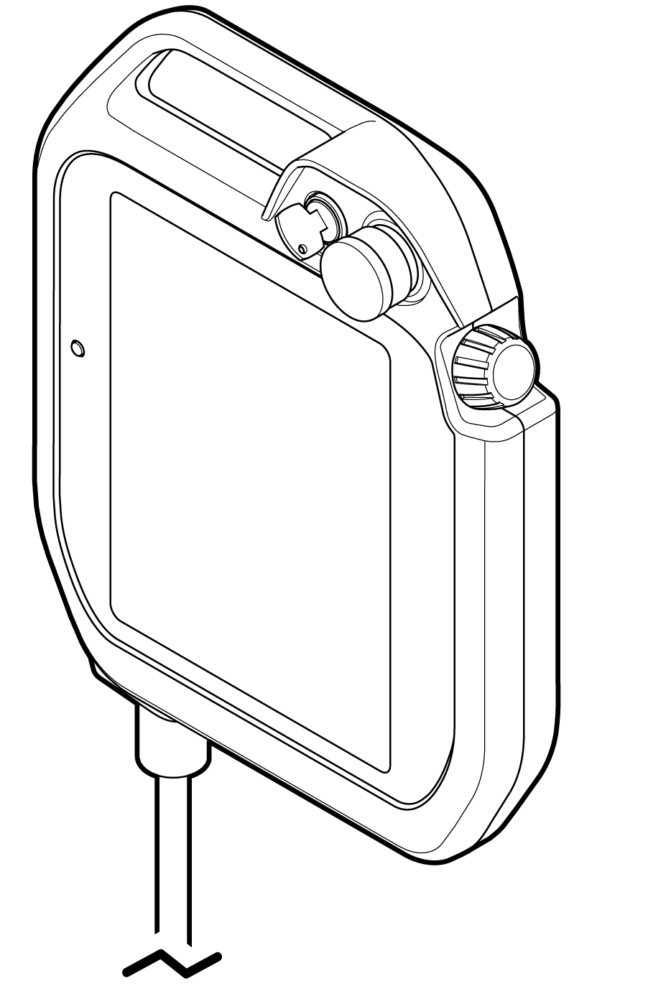

# 4.3.7 Teach pendant

The teach pendant \(TP600\) directly manipulates the collaborative robot and checks its state of operation and setting.

The teach pendant is connected with the microcomputer module \(miniH6COM, EBC-GF53\) through Ethernet communication and has major functions as follows:

* Monitoring: operating program, data of the axes, I/O signals, robot state, etc.

* History management: system version, operating time, error history, stoppage history, etc.

* File management: upload/download of versions and teach programs

* Parameter setting: user environment, control, robot, application, automatic integer setting, etc.

* Robot teaching: registration of jog and teaching programs

* Robot operation: motor on, start, stop, and mode setting

The teach pendant has a three-step enabling switch, an emergency stop switch, etc. for user safety. At its lower part, it has a USB connection port \(Type A\) for storing or downloading files to USB memory sticks, etc. For more details on how to use the teach pendant, see the “[**Operation Manual for Hi6 Controllers**](https://hyundai-robotics.gitbook.io/hi6-operation-manual/v/english/)” and the “**Safety Function Manual for Collaborative Robots**.”

