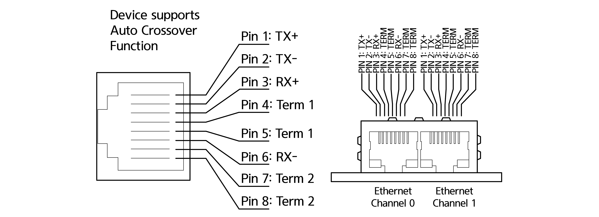

# 4.3.8.1 커넥터 핀 맵

통신에 사용하는 커넥터의 핀 구성은 PCB 통신 카드에 따라 다릅니다.

| **번호** | **신호** | 　　　　　　　**설명**                                                                                        |
| :----: | :----: | ---------------------------------------------------------------------------------------------------- |
|    1   |   TX+  | Transmit data +                                                                                      |
|    2   |   TX-  | Transmit data -                                                                                      |
|    3   |   RX+  | Receive data +                                                                                       |
|    4   |  Term1 | 
Connected to each other and terminated to PE through RC circuit

(Bob Smith Termination)
 |
|    5   |  Term1 | 
Connected to each other and terminated to PE through RC circuit

(Bob Smith Termination)
 |
|    6   |   RX-  | Receive data -                                                                                       |
|    7   |  Term2 | 
Connected to each other and terminated to PE through RC circuit

(Bob Smith Termination)
 |
|    8   |  Term2 | 
Connected to each other and terminated to PE through RC circuit

(Bob Smith Termination)
 |

| **번호** | **신호** | 　　　　　　　**설명** |
| :----: | :----: | ------------- |
|    1   |   DA   | Data A        |
|    2   |   DB   | Data B        |
|    3   |   DG   | Data Ground   |
|    4   |   SLD  | Shield        |
|    5   |   FG   | Field Ground  |

| **번호** | **신호** | 　　　　　　**설명**                                 |
| :----: | :----: | -------------------------------------------- |
|    1   |   V-   | Reference potential DeviceNet supply voltage |
|    2   |  CAN_L | CAN Low-Signal                               |
|    3   |  Drain | Shield                                       |
|    4   |  CAN_H | CAN High-Signal                              |
|    5   |   V+   | +24 V DeviceNet supply voltage               |

| **번호** |   **신호**  | 　　　　　　　**설명**                                      |
| :----: | :-------: | -------------------------------------------------- |
|    3   | RxD/TxD-P | Receive/Send Data-P respectively connection B plug |
|    5   |    DGND   | Reference potential                                |
|    6   |     VP    | Positive supply voltage                            |
|    8   | RxD/TxD-N | Receive/Send Data-N respectively connection A plug |
