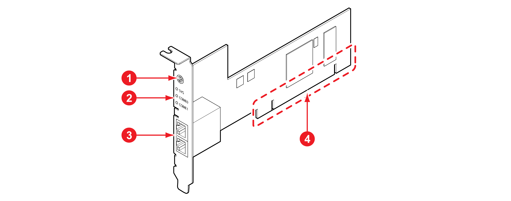
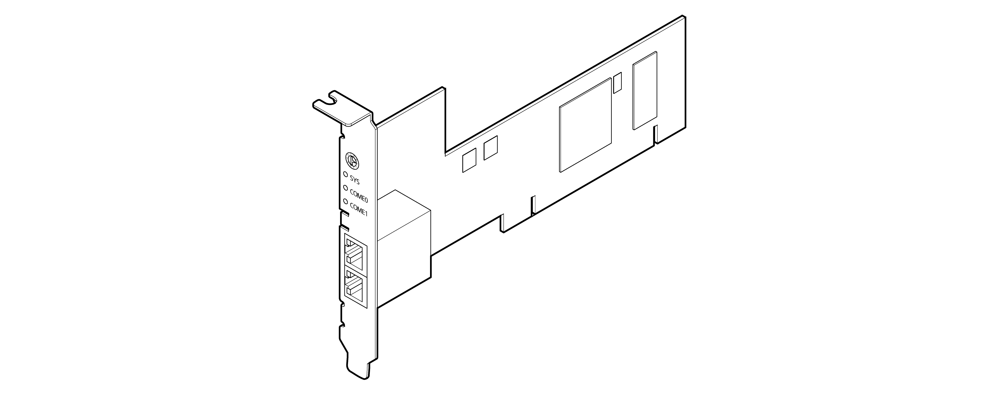

# 4.3.8 PCI 통신 카드\(옵션\)

협동로봇 제어기에서 PCI 통신 카드로 산업용 통신을 사용합니다. 보편적인 모델인 이더넷용 PCI 통신 카드를 기준으로 사용할 수 있는PCI 통신 카드의 모델과 카드의 구성 및 기능에 대해 설명합니다. 자세한 내용은 Hilscher사의 “**PC Cards CIFX 50 모델**”을 참조하십시오\(PC Cards CIFX 50 50E 70E 100EH UM 51 EN\).

PCI 통신 카드의 각 부분의 이름과 기능, 모델은 다음과 같습니다.

<table>
  <thead>
    <tr>
      <th style="text-align:center"><b>&#xBC88;&#xD638;</b>
      </th>
      <th style="text-align:center"><b>&#xC774;&#xB984;</b>
      </th>
      <th style="text-align:left"><b>                                                            &#xC124;&#xBA85;</b>
      </th>
    </tr>
  </thead>
  <tbody>
    <tr>
      <td style="text-align:center">
        
      </td>
      <td style="text-align:center">&#xB85C;&#xD130;&#xB9AC; &#xC2A4;&#xC704;&#xCE58;</td>
      <td style="text-align:left">
        
&#xC2AC;&#xB86F; &#xBC88;&#xD638;&#xC5D0; &#xB530;&#xB77C; &#xD1B5;&#xC2E0;&#xC744;
          &#xC124;&#xC815;&#xD558;&#xC5EC; &#xC0AC;&#xC6A9;&#xD569;&#xB2C8;&#xB2E4;.

        
MiniH6COM PCI &#xC2AC;&#xB86F;&#xC758; &#xC704;&#xCE58;&#xC5D0; &#xB530;&#xB77C;
          &#xB85C;&#xD130;&#xB9AC; &#xC2A4;&#xC704;&#xCE58;&#xB97C;

        
&#xC0C1;&#xB2E8;&#xC5D0;&#xC11C;&#xBD80;&#xD130; 1 ~ 2&#xBC88;&#xC73C;&#xB85C;
          &#xC124;&#xC815;&#xD569;&#xB2C8;&#xB2E4;.

      </td>
    </tr>
    <tr>
      <td style="text-align:center">
        
      </td>
      <td style="text-align:center">LED &#xB7A8;</td>
      <td style="text-align:left">
        <ul>
          <li>SYS: &#xC2DC;&#xC2A4;&#xD15C; &#xC0C1;&#xD0DC;&#xB97C; &#xD45C;&#xC2DC;&#xD569;&#xB2C8;&#xB2E4;.
             
            <ul>
              <li>&#xCD08;&#xB85D;&#xC0C9;: &#xC2DC;&#xC2A4;&#xD15C;&#xC774; &#xC815;&#xC0C1;&#xC801;&#xC73C;&#xB85C;
                &#xB3D9;&#xC791; &#xC911;&#xC785;&#xB2C8;&#xB2E4;.
                 
              </li>
              <li>&#xB178;&#xB780;&#xC0C9;: &#xBD80;&#xD2B8; &#xB85C;&#xB354; &#xB300;&#xAE30;
                &#xC911;&#xC785;&#xB2C8;&#xB2E4;.
                 
              </li>
            </ul>
          </li>
          <li>COM0, COM1: &#xD1B5;&#xC2E0; &#xC0C1;&#xD0DC;&#xB97C; &#xD45C;&#xC2DC;&#xD569;&#xB2C8;&#xB2E4;.
             
            <ul>
              <li>&#xCD08;&#xB85D;&#xC0C9;: &#xC815;&#xC0C1;&#xC801;&#xC73C;&#xB85C; &#xD1B5;&#xC2E0;
                &#xC911;&#xC785;&#xB2C8;&#xB2E4;.
                 
              </li>
              <li>&#xBE68;&#xAC04;&#xC0C9;: &#xD1B5;&#xC2E0; &#xC5D0;&#xB7EC;&#xAC00; &#xBC1C;&#xC0DD;&#xD558;&#xC600;&#xC2B5;&#xB2C8;&#xB2E4;.
                 
              </li>
            </ul>
          </li>
        </ul>
      </td>
    </tr>
    <tr>
      <td style="text-align:center">
        
      </td>
      <td style="text-align:center">&#xD1B5;&#xC2E0; &#xC5F0;&#xACB0; &#xB2E8;&#xC790;</td>
      <td style="text-align:left">&#xD1B5;&#xC2E0;&#xC6A9; &#xCF00;&#xC774;&#xBE14;&#xC744; &#xC5F0;&#xACB0;&#xD558;&#xC5EC;
        &#xC678;&#xBD80; &#xC7A5;&#xCE58;&#xC640; &#xD1B5;&#xC2E0;&#xD569;&#xB2C8;&#xB2E4;.</td>
    </tr>
    <tr>
      <td style="text-align:center">
        
      </td>
      <td style="text-align:center">PCI &#xBC84;</td>
      <td style="text-align:left">PC &#xC5F0;&#xACB0;&#xC6A9; &#xBC84;&#xC2A4;(Bus)&#xB85C; &#xC678;&#xBD80;
        PC&#xC640; &#xD1B5;&#xC2E0;&#xD569;&#xB2C8;&#xB2E4;.</td>
    </tr>
  </tbody>
</table>

| **모델명** |                                **설명** |                      **접속 커넥터** |
| :---: | :--- | :--- |
| CIFX 50-RE/ML-HRC | HRC Real-Time Ethernet Master PCI | RJ45 Socket |
| CIFX 50-RE-HRC | HRC Real-Time Ethernet Slave PCI | RJ45 Socket |
| CIFX 50E-RE/ML-HRC | HRC Real-Time Ethernet Master PCIe | RJ45 Socket |
| CIFX 50E-RE-HRC | HRC Real-Time Ethernet Slave PCIe | RJ45 Socket |
| CIFX 50-CC-HRC | CC-Link Slave PCI | CombiCon Male Connector, 5 pin |
| CIFX 50E-CC-HRC | CC-Link Slave PCIe | CombiCon Male Connector, 5 pin |
| CIFX 50-DN/ML-HRC | DeviceNet Maser PCI | CombiCon Male Connector, 5 pin |
| CIFX 50-DN-HRC | DeviceNet Slave PCI | CombiCon Male Connector, 5 pin |
| CIFX 50E-DN/ML-HRC | DeviceNet Maser PCIe | CombiCon Male Connector, 5 pin |
| CIFX 50E-DN-HRC | DeviceNet Slave PCIe | CombiCon Male Connector, 5 pin |
| CIFX 50-DP/ML-HRC | PROFIBUS Master PCI | Dsub female connector, 9 pin |
| CIFX 50-DP-HRC | PROFIBUS Slave PCI | Dsub female connector, 9 pin |
| CIFX 50E-DP/ML-HRC | PROFIBUS Master PCIe | Dsub female connector, 9 pin |
| CIFX 50E-DP-HRC | PROFIBUS Slave PCIe | Dsub female connector, 9 pin |
| CIFX 50E-CCIES-HRC | CC-Link IE Fileld PCIe | RJ45 Socket |

