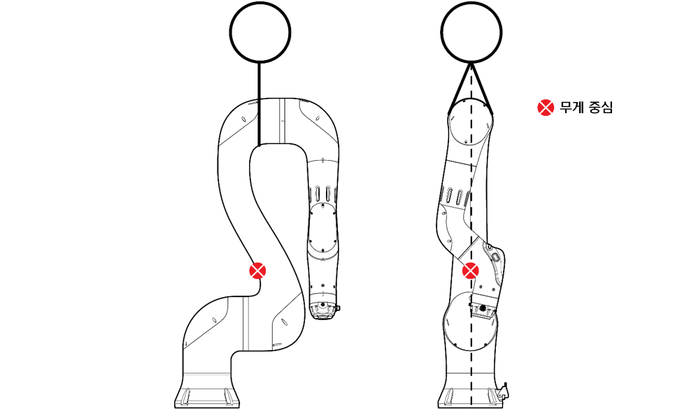

# 5.1 운반 방법

협동로봇의 무게와 주의 사항을 확인하고 올바른 방법으로 안전에 유의하여 제품을 운반하십시오.

협동로봇을 직접 이동하려면, 이동에 적절한 자세로 협동로봇을 설정하고 2인 이상의 작업자가 동시에 들어올려 원하는 위치로 옮기십시오.


**\[주의]**

*   협동로봇을 직접 옮기고자 하는 경우에는 2인 이상의 작업자가 동시에 들어 운반하십시오.

*   2인 이상의 작업자가 함께 작업할 경우에는 연결 부위에 손상을 줄 수 있으므로 주의하십시오.

* 협동로봇을 바닥에 그대로 내려 놓으면, 프레임 커버가 파손될 수 있습니다.


리프팅 장비를 이용해 협동로봇을 이동하려면, 리프팅에 적절한 자세로 협동로봇을 설정하고 슬링 벨트로 크레인에 연결한 후 들어올려 원하는 위치로 옮기십시오.

*   리프팅에 적절한 자세는 제품을 직접 운반하는 경우와 동일합니다.

    “[**5.1.1 추천 자세**](1-recommend-posture.md)”를 참조하여 협동로봇을 공장 출하 시의 자세로 설정할 것을 권장합니다.

*   크레인의 최소 용량은 0.2 t이며 협동로봇의 모델별 무게는 다음과 같습니다.

    YL005: 27 kg, YL012: 43 kg, YL015: 41 kg


**\[경고]**

*   리프팅 장비를 이용해 운반하는 경우에는 해당 국가 및 지역의 안전 규정 및 장비 사용 지침을 준수해야 합니다.

* 크레인을 이용해 이동할 때에는 제품 아래에 작업자가 없는지 반드시 확인하십시오. 또한, 절대 크레인 또는 제품 아래에서 작업하거나 지나다니지 마십시오.



**\[주의]**: 협동로봇에 부가 장비를 연결하면 무게 중심이 다른 부분으로 이동하므로 리프팅이 어려워집니다.

