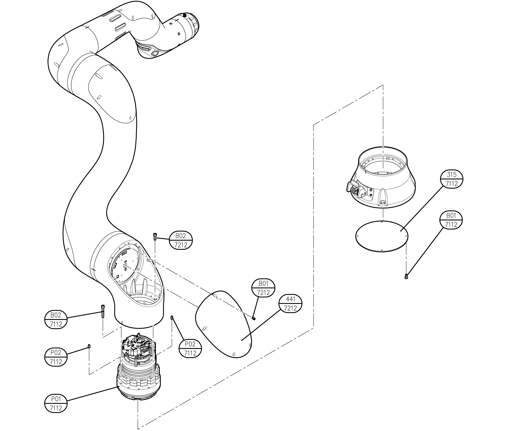

# 6.1.1 YL012 S-axis

<table>
  <thead>
    <tr>
      <th style="text-align:center">No</th>
      <th style="text-align:center"><b>Description</b>
      </th>
      <th style="text-align:center">
        
Material

        
(manufacturer)

      </th>
      <th style="text-align:center">Quantity</th>
    </tr>
  </thead>
  <tbody>
    <tr>
      <td style="text-align:center">7112-315</td>
      <td style="text-align:center">BOTTOM COVER</td>
      <td style="text-align:center">A6061-T6</td>
      <td style="text-align:center">1</td>
    </tr>
    <tr>
      <td style="text-align:center">7112-P01</td>
      <td style="text-align:center">MODULE 32 TS</td>
      <td style="text-align:center">ABS</td>
      <td style="text-align:center">1</td>
    </tr>
    <tr>
      <td style="text-align:center">7112- P02</td>
      <td style="text-align:center">PARALLEL PIN 5X10</td>
      <td style="text-align:center"></td>
      <td style="text-align:center">2</td>
    </tr>
    <tr>
      <td style="text-align:center">7112-B01</td>
      <td style="text-align:center">HEX SOCEKT BOLT M4X10</td>
      <td style="text-align:center">12.9</td>
      <td style="text-align:center">4</td>
    </tr>
    <tr>
      <td style="text-align:center">7112-B02</td>
      <td style="text-align:center">HEX SOCEKT BOLT M5X10</td>
      <td style="text-align:center">12.9</td>
      <td style="text-align:center">12</td>
    </tr>
    <tr>
      <td style="text-align:center">7212-441</td>
      <td style="text-align:center">LOWER FRAME COVER</td>
      <td style="text-align:center">ABS</td>
      <td style="text-align:center">1</td>
    </tr>
    <tr>
      <td style="text-align:center">7212-B01</td>
      <td style="text-align:center">HEX SOCKET BOLT M3X6</td>
      <td style="text-align:center">12.9</td>
      <td style="text-align:center">5</td>
    </tr>
    <tr>
      <td style="text-align:center">7212-B02</td>
      <td style="text-align:center">HEX SOCKET BOLT M5X18</td>
      <td style="text-align:center">12.9</td>
      <td style="text-align:center">10</td>
    </tr>
  </tbody>
</table>

