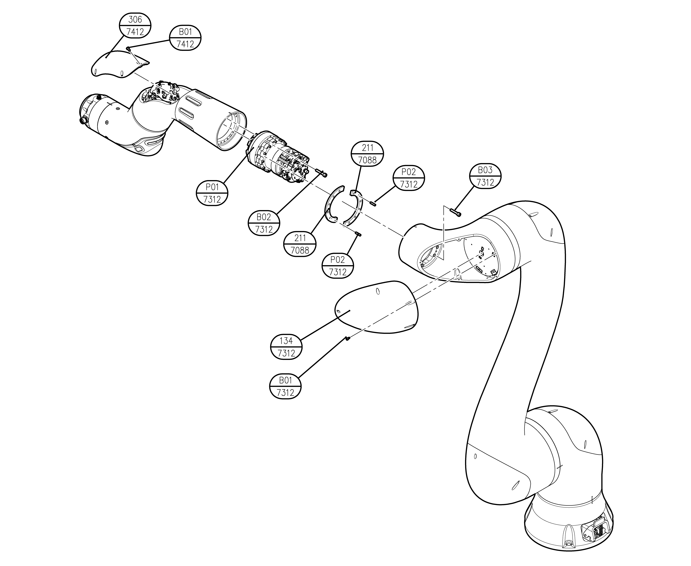

# 6.1.4 YL012 R-axis

|  **No**  |    **Description**    | 
<strong>Material</strong>

<strong>(manufacturer)</strong>
 | **Quantity** |
| :------: | :-------------------: | :--------------------------------------------------------------------: | :----------: |
| 7088-211 |  WASHER PLATE FOR M20 |                                A6061-T6                                |       2      |
| 7312-134 |    ARM FRAME COVER    |                                   ABS                                  |       1      |
| 7312-P01 |      MODULE 20 TS     |                                                                        |       1      |
| 7312-P02 |   PARALLEL PIN M4X15  |                                                                        |       2      |
| 7312-B01 |  HEX SOCEKT BOLT M3X6 |                                  12.9                                  |       5      |
| 7312-B02 | HEX SOCEKT BOLT M3X30 |                                  12.9                                  |      12      |
| 7312-B03 | HEX SOCEKT BOLT M4X25 |                                  12.9                                  |      10      |
| 7412-306 |     ARM PIPE COVER    |                                   ABS                                  |       1      |
| 7412-B01 |  HEX SOCKET BOLT M3X6 |                                  12.9                                  |       6      |
