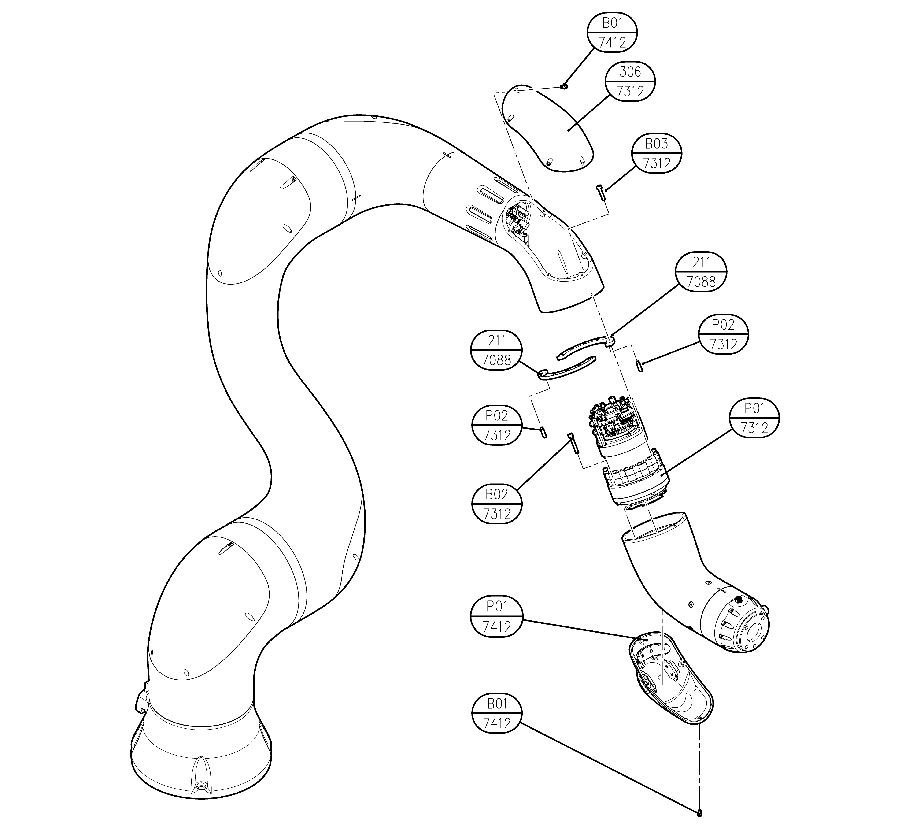

# 6.1.5  YL012 B축

| **번호** | **설명** | **재질\(제조사\)** | **수량** |
| :---: | :---: | :---: | :---: |
| 7088-211 | WASHER PLATE FOR M20 | A6061-T6 | 2 |
| 7312-306 | ARM PIPE COVER | ABS | 1 |
| 7312-P01 | MODULE 20 TS |  | 1 |
| 7312-P02 | PARALLEL PIN M4X15 |  | 2 |
| 7312-B01 | HEX SOCEKT BOLT M3X6 | 12.9 | 6 |
| 7312-B02 | HEX SOCEKT BOLT M3X30 | 12.9 | 12 |
| 7312-B03 | HEX SOCEKT BOLT M4X25 | 12.9 | 10 |
| 7412-P01 | HAND GRIP MODULE |  | 1 |
| 7412-B01 | M3 소경볼트 |  | 4 |

