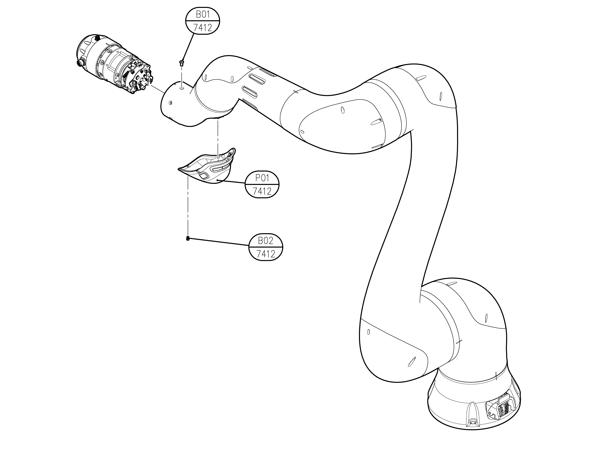

# 6.1.6 YL012 R1-axis

<table>
  <thead>
    <tr>
      <th style="text-align:center">No</th>
      <th style="text-align:center"><b>Description</b>
      </th>
      <th style="text-align:center">
        
Material

        
(manufacturer)

      </th>
      <th style="text-align:center">Quantity</th>
    </tr>
  </thead>
  <tbody>
    <tr>
      <td style="text-align:center">7412-P01</td>
      <td style="text-align:center">HAND GRIP MODULE</td>
      <td style="text-align:center"></td>
      <td style="text-align:center">1</td>
    </tr>
    <tr>
      <td style="text-align:center">7412-B01</td>
      <td style="text-align:center">HEX SOCEKT FLAT HEAD SCREW M4X10</td>
      <td style="text-align:center">12.9</td>
      <td style="text-align:center">6</td>
    </tr>
    <tr>
      <td style="text-align:center">7412-B02</td>
      <td style="text-align:center">M3 &#xC18C;&#xACBD;&#xBCFC;&#xD2B8;</td>
      <td style="text-align:center">12.9</td>
      <td style="text-align:center">6</td>
    </tr>
  </tbody>
</table>

