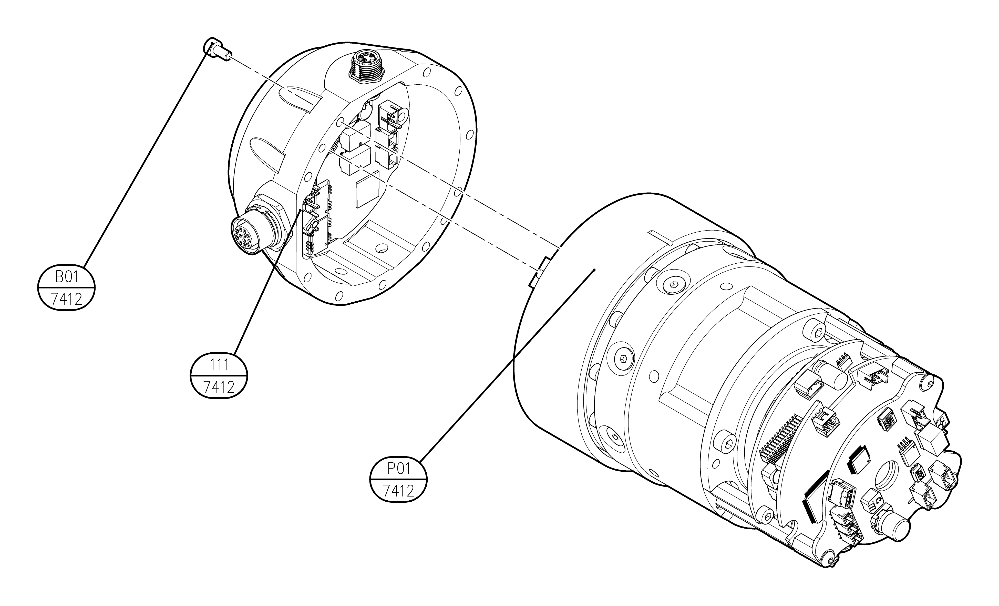

# 6.1.7 YL012 툴 플랜지

| **번호** | **설명** | **재질\(제조사\)** | **수량** |
| :---: | :---: | :---: | :---: |
| 7412-111 | MECHANICAL INTERFACE | A60610T6 | 1 |
| 7412-P01 | MODULE 40 TS |  | 1 |
| 7412-B01 | HEX SOCEKT FLAT HEAD SCREW M4X10 | 12.9 | 6 |

