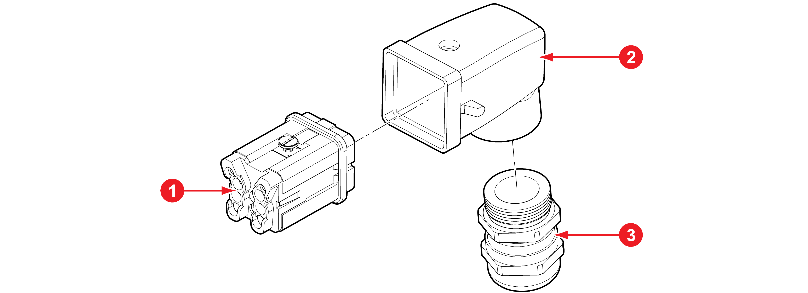

# 6.1.8 전원 연결용 커넥터

|                     **번호**                    |         **항목**        |       **사양**       |  **주문 번호** |      **제조사**      |
| :-------------------------------------------: | :-------------------: | :----------------: | :--------: | :---------------: |
|  |          인서트          |     HDC HA 4 ES    | 1498400000 | 바이드뮬러(Weidmuller) |
|  | 
플러그

인클로저
 | HDC 04A TWLU 1M20G | 1788810000 | 바이드뮬러(Weidmuller) |
|  |  
케이블

엔트리
 |   VG M20 - MS 68   | 1772220000 | 바이드뮬러(Weidmuller) |
