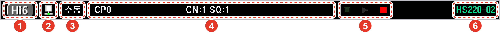

# Notation rules

This manual utilizes the following expression rules and safety directions for easy understanding.

### <mark style="color:green;">Description by figures</mark>

Figures are used for a better understanding of how to operate the product and for describing screens. When a description is made by a figure, the pertaining part is marked with the figure number that describes the part as shown in the following figure:

### <mark style="color:green;">GUI (Graphical User Interface)</mark>

Regarding GUI, any menu name or button name will be in brackets (**\[ ]**) and in **bold type**. When multiple menus need to be selected in the listed order, the menu names will be separated by the symbol (>).

*   Menu having a title: On the initial screen of the manual or automatic mode, select the **\[Menu]** button.

*   Multiple menus: In the initial screen of the manual mode, select the **\[Set Up]** button > **\[5: Reset > 7: Unit Setting]** menu.

### <mark style="color:green;">Manipulation key notation method</mark>

Any key to be pressed in the functional manipulation area of the teach pendant will be in angle brackets (**< >**) and in** bold type**.

* Pressing the **\<Start>** key will initiate the automatic execution of the sequence programmed into the robot.

### <mark style="color:green;">Cross-references</mark>

This provides the shortcut to the related information in the manual. Cross-references will be in quotation marks and in** bold type**.

* For details of making changes in date and time information, see “**4.5 Date and time setting**.” of “**Operation Manual for Hi6 Controller**”  

### <mark style="color:green;">References</mark>

Useful or additional information on using the product will be provided as follows:


The blinking of the icon in the status bar indicates the engineer mode.

